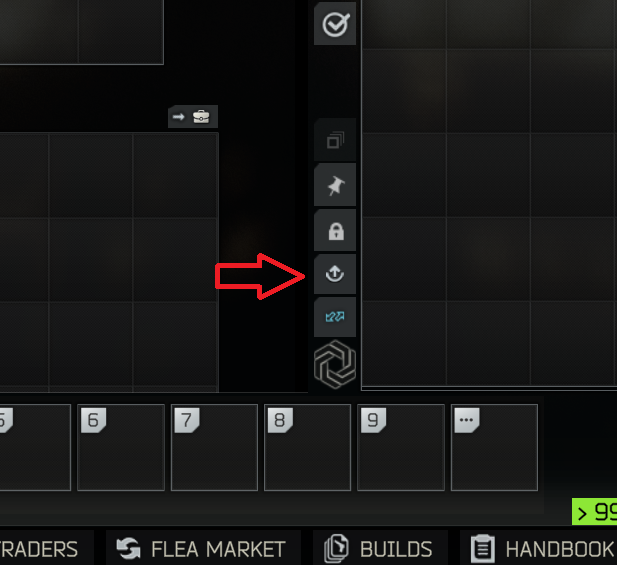

# SPT 4.1 – Beta-Mods

Übersicht aller Mods im Beta-Test · Stand: **2026-08-14 18:15** · 30 Mods mit Download, 5 in Entwicklung.

**Installation:** ZIP über den Download-Link laden und in den SPT-Stammordner entpacken
(der Ordner, in dem `EscapeFromTarkov.exe` liegt), vorhandene Dateien überschreiben.
Die ZIPs bringen die richtige Ordnerstruktur mit: Client-Mods landen in `BepInEx\plugins\`,
Server-Mods in `SPT_Runtime\user\mods\`. Bei **Client + Server** stecken beide Teile im ZIP
und beide müssen installiert sein.

**Build-Kennung:** Dev-Builds bekommen nicht immer eine neue Versionsnummer – eindeutig ist
die Kennung hinter dem `+` (Commit-ID bzw. Datei-Hash), z. B. `1.2.0+7b65898`.
Bitte bei Fehlermeldungen immer mit angeben.

| Mod | Version | Stand | Typ | Beschreibung | Vorschau | Download |
|---|---|---|---|---|---|---|
| [**AutoCorpseSearch**](#autocorpsesearch) | `1.1.0+12b8cc0` | 2026-08-04 | Client | Automatically starts searching a corpse's equipment slots when you open the loot screen — no more clicking "Search" on each slot individually. | – | [⬇ ZIP](https://github.com/maschine34675/spt-beta-hub/raw/main/downloads/AutoCorpseSearch-1.1.0-12b8cc0.zip) |
| [**AutoIFF**](#autoiff) | `1.2.0+4baecec` | 2026-08-04 | Client | Automatically identifies the target you are currently aiming at as **Friendly** or **Hostile**, and alerts you when you are marked as a **Scav traitor**. | – | [⬇ ZIP](https://github.com/maschine34675/spt-beta-hub/raw/main/downloads/AutoIFF-1.2.0-4baecec.zip) |
| [**BangAndClear**](#bangandclear) | `0.9.0+3111b16` | 2026-08-11 | Client | An SPT 4.0 client mod for tactical door work: crack a door open a few degrees, put a grenade through the gap, close the door, wait for the bang. | – | [⬇ ZIP](https://github.com/maschine34675/spt-beta-hub/raw/main/downloads/BangAndClear-0.9.0-3111b16.zip) |
| [**BtrTurretControl**](#btrturretcontrol) | `1.0.0+37e08ef` | 2026-08-14 | Client | Client-only SPT mod that lets a seated BTR passenger take direct control of the gun turret. | – | [⬇ ZIP](https://github.com/maschine34675/spt-beta-hub/raw/main/downloads/BtrTurretControl-1.0.0-37e08ef.zip) |
| [**ClusterGrenade**](#clustergrenade) | `2.2.1+5fe2678` | 2026-08-13 | Client + Server | Clustergranate für SPT: Bei der Explosion werden keine Schrapnelle erzeugt, sondern mehrere Aufschlag-Bomblets (Splitter oder Blend, gewichteter Mix). Zusätzlich gibt es… | – | [⬇ ZIP](https://github.com/maschine34675/spt-beta-hub/raw/main/downloads/ClusterGrenade-2.2.1-5fe2678.zip) |
| [**CombatSlide**](#combatslide) | `2.0.0+c57f2f8` | 2026-08-09 | Client | Aus dem Sprint die Crouch-Taste drücken und in der Hocke weitergleiten – „Slide“ wie in anderen Ego-Shootern. | – | [⬇ ZIP](https://github.com/maschine34675/spt-beta-hub/raw/main/downloads/CombatSlide-2.0.0-c57f2f8.zip) |
| [**CorpseRun**](#corpserun) | `0.9.0+0a62fa2` | 2026-08-14 | Client + Server | Nach dem Tod im Raid optional (nackt) respawnen, die eigene Leiche looten und den Raid fortsetzen; bei Aufgeben normaler Raid-Abschluss. | – | [⬇ ZIP](https://github.com/maschine34675/spt-beta-hub/raw/main/downloads/CorpseRun-0.9.0-0a62fa2.zip) |
| [**CraftQueue**](#craftqueue) | `2.0.0+44fce17` | 2026-08-09 | Client + Server | CraftQueue moves normal SPT hideout crafting into a central, local web interface. Crafts can be queued across stations, monitored, retried and cancelled without opening… | <a href="#craftqueue"></a> | [⬇ ZIP](https://github.com/maschine34675/spt-beta-hub/raw/main/downloads/CraftQueue-2.0.0-44fce17.zip) |
| [**DefaultAutoFireMode**](#defaultautofiremode) | `2.0.0+d91bbc4` | 2026-08-08 | Client | Inspired by Default Fire Mode Fixer by acidphantasm but using a different approach. | – | [⬇ ZIP](https://github.com/maschine34675/spt-beta-hub/raw/main/downloads/DefaultAutoFireMode-2.0.0-d91bbc4.zip) |
| [**DualSideDoorBreach**](#dualsidedoorbreach) | `2.0.0+7523eb5` | 2026-08-08 | Client | Tushonka doors have opinions. Hinge side only. Swing into your face. Locked for no reason. This mod disagrees. | <a href="#dualsidedoorbreach"></a> | [⬇ ZIP](https://github.com/maschine34675/spt-beta-hub/raw/main/downloads/DualSideDoorBreach-2.0.0-7523eb5.zip) |
| [**EasyMounting**](#easymounting) | `2.0.0+7e1450e` | 2026-08-08 | Client + Server | An SPT mod bundle that makes bipod deployment and weapon mounting (ledges, windowsills, railings, etc.) far less picky about the surface. Two parts, shipped together: | – | [⬇ ZIP](https://github.com/maschine34675/spt-beta-hub/raw/main/downloads/EasyMounting-2.0.0-7e1450e.zip) |
| [**KillAndDamageInfo**](#killanddamageinfo) | `0.9.0+dd0e920` ⚠️Debug | 2026-08-14 | Client | KillAndDamageInfo shows the combat information the game keeps to itself: what your kills died to, who killed you and in what state they were, what each hit actually did… | – | [⬇ ZIP](https://github.com/maschine34675/spt-beta-hub/raw/main/downloads/KillAndDamageInfo-0.9.0-dd0e920.zip) |
| [**Killcam**](#killcam) | `1.0.0+aec3dc4` | 2026-08-09 | Client | „Killcam light“: Beim Tod wechselt die Kamera für ca. 6 Sekunden in die Ego-Perspektive des Killers; das Death-Panel zeigt Killer-Name und Rest-HP. | – | [⬇ ZIP](https://github.com/maschine34675/spt-beta-hub/raw/main/downloads/Killcam-1.0.0-aec3dc4.zip) |
| [**KillcamReplay**](#killcamreplay) | `0.9.2+8dd53d0` ⚠️Debug | 2026-08-14 | Client | Echte Killcam: Beim Tod wird die letzte Aktion aus Sicht des Killers als Replay der aufgezeichneten letzten Sekunden abgespielt. | – | [⬇ ZIP](https://github.com/maschine34675/spt-beta-hub/raw/main/downloads/KillcamReplay-0.9.2-8dd53d0.zip) |
| [**LinkedSearchInStash**](#linkedsearchinstash) | `2.0.0+89b5564` | 2026-08-08 | Client | Extends Tushonka’s Linked Search to your own stash. Adds a separate context-menu action that opens the stash search window filtered to items that are actually compatible… | – | [⬇ ZIP](https://github.com/maschine34675/spt-beta-hub/raw/main/downloads/LinkedSearchInStash-2.0.0-89b5564.zip) |
| [**ModProfiler**](#modprofiler) | `2.0.0+17b90f4` | 2026-08-14 | Client | In-Game-Profiler für SPT nach dem Vorbild von **Dubs Performance Analyzer** (RimWorld): zeigt live, wie viel CPU-Zeit jede installierte Client-Mod pro Frame kostet — um… | – | [⬇ ZIP](https://github.com/maschine34675/spt-beta-hub/raw/main/downloads/ModProfiler-2.0.0-17b90f4.zip) |
| [**ModSourceDebugger**](#modsourcedebugger) | `1.2.1+19c0f81` | 2026-08-04 | Client + Server | Debug-Werkzeug: verfolgt Item-Templates und UI-Elemente zurück zu der Mod, die sie hinzugefügt hat (Tooltips + UI-Inspektor). | – | [⬇ ZIP](https://github.com/maschine34675/spt-beta-hub/raw/main/downloads/ModSourceDebugger-1.2.1-19c0f81.zip) |
| [**MoreQuickSlots**](#morequickslots) | `2.0.0+93f6d8a` | 2026-08-08 | Client | Increases the number of freely assignable quick slots (7 by default: keys 4–0) by up to 6 additional slots. | – | [⬇ ZIP](https://github.com/maschine34675/spt-beta-hub/raw/main/downloads/MoreQuickSlots-2.0.0-93f6d8a.zip) |
| [**NotificationFilter**](#notificationfilter) | `2.0.0+b46354e` | 2026-08-08 | Client | NotificationFilter gives you full control over the notification popups that appear during raids. | – | [⬇ ZIP](https://github.com/maschine34675/spt-beta-hub/raw/main/downloads/NotificationFilter-2.0.0-b46354e.zip) |
| [**QuestMarkers**](#questmarkers) | `0.1.0+7af46a3` | 2026-08-14 | Client | World-anchored HUD markers for your unfinished quest objectives: zones to visit, spots to place items or beacons at, and quest items lying in the raid. No more running… | – | [⬇ ZIP](https://github.com/maschine34675/spt-beta-hub/raw/main/downloads/QuestMarkers-0.1.0-7af46a3.zip) |
| [**RaidInfoPanels**](#raidinfopanels) | `1.0.0+e1f83d9` | 2026-08-13 | Client | Stabile Ersatz-Mod für die GamePanelHUD Weapon/Health-Panels auf SPT 4.x. | <a href="#raidinfopanels"></a> | [⬇ ZIP](https://github.com/maschine34675/spt-beta-hub/raw/main/downloads/RaidInfoPanels-1.0.0-e1f83d9.zip) |
| [**RaidMenuCleanupFix**](#raidmenucleanupfix) | `2.0.0+72189da` | 2026-08-08 | Client | Removes the brief freeze when opening the escape menu during a raid in SPT (Single Player Tushonka). | – | [⬇ ZIP](https://github.com/maschine34675/spt-beta-hub/raw/main/downloads/RaidMenuCleanupFix-2.0.0-72189da.zip) |
| [**ReceiveAllChats**](#receiveallchats) | `2.0.0+8ebaa2e` | 2026-08-09 | Client + Server | Der Messenger-Button „Receive All“ sammelt Anhänge aus allen Chats ein, nicht nur aus dem aktuell ausgewählten. | – | [⬇ ZIP](https://github.com/maschine34675/spt-beta-hub/raw/main/downloads/ReceiveAllChats-2.0.0-8ebaa2e.zip) |
| [**ScopeRangefinder**](#scoperangefinder) | `3.0.0+f5345e8` | 2026-08-07 | Client | Adds a compact rangefinder readout to magnified optic scopes in SPT. The display is rendered inside the scope view, follows the optic while aiming, and can be adjusted… | – | [⬇ ZIP](https://github.com/maschine34675/spt-beta-hub/raw/main/downloads/ScopeRangefinder-3.0.0-f5345e8.zip) |
| [**StashFilter**](#stashfilter) | `1.0.0+f287253` | 2026-08-13 | Client | StashFilter adds a filter and sort panel to the stash search window, so you can find the right weapon, armor piece, magazine, round, med or attachment without scrolling… | <a href="#stashfilter"></a> | [⬇ ZIP](https://github.com/maschine34675/spt-beta-hub/raw/main/downloads/StashFilter-1.0.0-f287253.zip) |
| [**SurroundAudio**](#surroundaudio) | `1.0.0+a29569c` | 2026-08-14 | Client | Experimental proof of concept: plays SPT on a real surround speaker setup (5.1/7.1) instead of binaural headphone audio. | – | [⬇ ZIP](https://github.com/maschine34675/spt-beta-hub/raw/main/downloads/SurroundAudio-1.0.0-a29569c.zip) |
| [**TraderSearch**](#tradersearch) | `1.0.0+76e4ad8` | 2026-08-04 | Client | Adds the search bar the trader window has always been missing. The stash and the flea market let you search for items by name — the trader buy screen does not. This mod… | – | [⬇ ZIP](https://github.com/maschine34675/spt-beta-hub/raw/main/downloads/TraderSearch-1.0.0-76e4ad8.zip) |
| [**UnloadAllMagazines**](#unloadallmagazines) | `2.0.0+18eee2a` | 2026-08-08 | Client | Originally, this was part of my debugging tools, but I found it so useful during normal gameplay that I spun it off from it. | <a href="#unloadallmagazines"></a> | [⬇ ZIP](https://github.com/maschine34675/spt-beta-hub/raw/main/downloads/UnloadAllMagazines-2.0.0-18eee2a.zip) |
| [**WeaponBuilderSearch**](#weaponbuildersearch) | `1.1.0+712c667` | 2026-08-04 | Client | Adds a live search field to the attachment dropdown in the **Weapon Builder** (Edit Build) and **Weapon Modding** screens. | – | [⬇ ZIP](https://github.com/maschine34675/spt-beta-hub/raw/main/downloads/WeaponBuilderSearch-1.1.0-712c667.zip) |
| [**WebOverlay**](#weboverlay) | `1.3.0+199576a` | 2026-08-11 | Client | Show web pages in windows over Escape From Tushonka, so a mod can build its user interface in HTML instead of an immediate-mode toolkit. | <a href="#weboverlay"></a> | [⬇ ZIP](https://github.com/maschine34675/spt-beta-hub/raw/main/downloads/WebOverlay-1.3.0-199576a.zip) |

## 🚧 In Entwicklung – noch kein Build

| Mod | Typ | Beschreibung |
|---|---|---|
| **AdaptiveArsenal** | Server | Adaptive Arsenal is an SPT 4.0 C# server mod prototype that tracks equipment usage after raids. |
| **AiStoryQuests** | Client + Server | Experiment: KI-generierte Story-Quests (Anbieter: OpenAI/Anthropic/Ollama, eigener API-Key nötig). |
| **AutoWishlist** | Client + Server | – |
| **StashSort** | Client | – |
| **UnloadAllMagazinesInventory** | Client | Adds an unload all magazines button that can be used in raid to each inventory slot. |

---

## AutoCorpseSearch

**Typ:** Client · **Version:** `1.1.0+12b8cc0` · **Stand:** 2026-08-04 06:36 · [⬇ Download](https://github.com/maschine34675/spt-beta-hub/raw/main/downloads/AutoCorpseSearch-1.1.0-12b8cc0.zip)

<details><summary><b>Nutzungshinweise anzeigen</b></summary>

Automatically starts searching a corpse's equipment slots when you open the loot screen — no more clicking "Search" on each slot individually.

Features

Auto-search on open — the moment you open a corpse's inventory, searching begins automatically on all equipped containers (Chest Rig, Pockets, Backpack)

Configurable search order — set the priority of each slot via the BepInEx F12 config menu (default: Chest Rig → Pockets → Backpack)

Resume partial searches — optionally re-start searching slots that were interrupted and still have hidden items (toggle in F12 menu, on by default)

Manual cancel is respected — cancelling a search mid-slot stops the entire chain; no slot is searched without your input

Inventory-close safe — closing the inventory immediately stops any pending searches; nothing runs in the background

Skills Extended compatible — works correctly with the double-search elite skill

</details>

---

## AutoIFF

**Typ:** Client · **Version:** `1.2.0+4baecec` · **Stand:** 2026-08-04 20:04 · [⬇ Download](https://github.com/maschine34675/spt-beta-hub/raw/main/downloads/AutoIFF-1.2.0-4baecec.zip)

<details><summary><b>Nutzungshinweise anzeigen</b></summary>

### AutoIFF — Automatic Identify Friend or Foe

Automatically identifies the target you are currently aiming at as **Friendly** or **Hostile**, and alerts you when you are marked as a **Scav traitor**.

Based on [LightsAutomaticIdentifier](https://hub.sp-tarkov.com/files/file/2669-lightsautomaticidentifier/) by **Light** (MIT License).

---

#### Features

- **Target identification** — aim at any bot to identify it as Friendly or Hostile after a short delay
- **Bot role display** — shows the target's role: PMC (USEC/BEAR), Scav, Sniper Scav, Raider, Boss (Killa, Reshala, Gluhar, Sanitar, Tagilla, Knight, Zryachiy, Shturman, Kaban, Kolontay, Partisan), Boss Follower, Cultist, Infected, and more
- **Skill scaling** — identification time and range are affected by your Attention, Perception, and Search skill levels, including Elite bonuses
- **Identification memory** — previously identified targets are remembered for 60 seconds (configurable), so you don't have to re-identify them
- **Scav traitor detection** — detects the exact moment a Scav group marks you as hostile and shows a flash alert in the bottom-right corner. The counter increments each time an additional group finds out, giving you a sense of how far the information has spread across the map
- **Activation mode** — set to *Automatic* (Scav raids only), *AlwaysOn*, *AlwaysOff*, or *Hotkey* (toggle on/off via a configurable keybind)
- **Friendly-only mode** — instantly highlights friendly targets only, with no identification delay; hostile targets show no label — useful for preventing friendly fire in any raid type
- **Fika support** — works in coop raids, including headless-hosted ones (see below)
- **Conflict detection** — if the original LightsAutomaticIdentifier is also installed, AutoIFF disables itself and shows a warning in-game

---

#### How It Works

While aiming down sights, a raycast is fired from the player camera. When it hits a bot within range, a short identification timer begins. Once complete, the target is labeled Friendly or Hostile based on whether it has registered the player as an enemy.

Scav traitor detection hooks directly into `BotsGroup.AddEnemy` — the single point through which all enemy-registration paths converge (direct hit response, group propagation, and zone-wide spread). This means the alert fires at the earliest possible moment, with no polling.

---

#### Fika Support

AutoIFF works with [Fika](https://project-fika.gitbook.io/) coop raids (requires Fika 2.3.x or newer; AutoIFF only needs to be installed on your own client):

- **When you are the raid host** (or playing regular SPT), bots run locally and identification uses the exact hostility data, just like in singleplayer.
- **When you join a raid hosted by someone else — including a headless host** — bot AI only exists on the host, so exact hostility data is not available on your machine. AutoIFF then derives friend-or-foe from the bot's role and your faction:
  - Human coop players are always shown as **Friendly** with their nickname
  - Bots that are hostile by default (e.g. everything vs. PMCs; cultists, Killa, Shturman, the Goons vs. player Scavs) are shown as **Hostile**
  - Bots that are *not* hostile at spawn but escalate when approached or provoked (e.g. bosses, Raiders, and Rogues vs. player Scavs) are shown as **Wary** in orange
  - If you damage an innocent Scav as a player Scav, AutoIFF assumes traitor status: the traitor warning fires and Scavs are labeled Hostile for the rest of the raid

The `Wary` label and the traitor assumption only exist in these client-joined coop raids — everywhere else the mod shows the bot AI's real state.

---

#### Configuration

All settings are available via BepInEx's configuration system (e.g. with [BepInEx Configuration Manager](https://hub.sp-tarkov.com/files/file/1304-bepinex-configuration-manager/)).

| Section | Setting | Default | Description |
|---|---|---|---|
| General | ActivationMode | Automatic | Automatic / AlwaysOn / AlwaysOff / Hotkey |
| General | ActivationHotkey | *(unbound)* | Keybind to toggle the mod when using Hotkey mode |
| General | FriendlyOnly | false | Only show friendly targets (no delay, hostile targets show nothing) |
| Identification | BaseIdentificationTime | 0.7s | Base time to identify a target |
| Identification | IdentificationRange | 100m | Maximum identification range |
| Identification | DistanceMultiplier | 0.1 | How much distance slows identification |
| Identification | MemoryDuration | 60s | How long identified targets are remembered |
| Skills | UseSkillScaling | true | Scale values based on Attention, Perception, Search |
| Display | ShowDistance | false | Show distance to target |
| Display | ShowBotRole | true | Show bot role below the Friendly/Hostile label |
| Display | ShowTraitorWarning | true | Show Scav traitor alert |
| Display | TraitorAlertDuration | 5s | How long each traitor alert stays on screen |

---

#### Credits

Original concept and implementation by **Light** — [LightsAutomaticIdentifier](https://hub.sp-tarkov.com/files/file/2669-lightsautomaticidentifier/).

</details>

---

## BangAndClear

**Typ:** Client · **Version:** `0.9.0+3111b16` · **Stand:** 2026-08-11 12:08 · [⬇ Download](https://github.com/maschine34675/spt-beta-hub/raw/main/downloads/BangAndClear-0.9.0-3111b16.zip)

<details><summary><b>Nutzungshinweise anzeigen</b></summary>

An SPT 4.0 client mod for tactical door work: crack a door open a few degrees, put a grenade
through the gap, close the door, wait for the bang.

No new animations - EFT doors rotate procedurally, so the crack reuses the vanilla door curve
and hand animation, and the throw is the vanilla underhand toss.

#### Door actions

- **Bang & clear** - the full maneuver as one action: cracks the door (if it isn't already),
  pulls up your top-priority grenade, aims at the gap, underhand-throws it through and closes
  the door again. Replaces the permanently disabled "Bang & clear" stub BSG left in the menu.
  Greyed out when you carry no grenade.
- **Crack Open** - just open the door ~15° and leave it. For AI and game logic the door still
  counts as closed. Throw manually, peek, listen.
- **Close Crack** - close a cracked door (full open also works from the cracked state).

#### Config (F12)

| Setting | Default | Description |
|---|---|---|
| Enabled | true | Add the actions to door menus. |
| CrackAngleDegrees | 15 | How far the door swings open when cracked. |
| CrackSpeed | 1.0 | Speed multiplier for the crack movement. |
| SqueakVolume | 0.35 | Volume of the squeak while cracking. |
| AutoCloseDoor | true | Bang & clear closes the door after the throw. |
| CloseDelaySeconds | 1.5 | Delay between the grenade leaving the hand and the door closing. |
| IgnoreDoorCollision | true | The scripted throw can't bounce back off the door leaf (frame/walls still block). |
| GuidedThrow | true | Redirect the toss through the gap regardless of standing position (speed kept, direction corrected). |
| AimSpeedDegPerSec | 360 | Turn speed of the scripted aim toward the gap. |
| AimHeightMeters | 0.9 | Aim height above your feet; lower rolls, higher tosses. |

#### Notes & compatibility

- Cracked doors keep `EDoorState.Shut`, so bots treat them as closed and will open them
  normally when pathing through - no bots bumping into half-open doors.
- The door's occlusion portal is kept open while cracked so the room behind the gap renders.
- Locked doors, sliding doors, keycard doors and exfil doors are excluded.
- Bang & clear uses the regular grenade hands controller (the vanilla quick-throw controller
  only supports the overhand toss), so the character really draws the grenade, underhand-throws
  it and returns to the weapon - all vanilla animations and voice lines.
- A grenade already held in the hands is used directly - even with the pin pulled for an
  overhand throw (the toss then goes overhand instead of underhand).
- Otherwise the grenade is picked like vanilla quick throw: quickslot priority grenade first,
  then the grenade slots.
- The door close is anchored to the moment the grenade actually leaves the hand, plus
  CloseDelaySeconds.
- Breaching a cracked door snaps it shut for a frame before the kick (vanilla kick curve
  starts at the closed angle) - cosmetic only.
- SPT single player only for now. In Fika co-op the crack angle is not synced to other clients.

#### Install

Drop `maschine-BangAndClear.dll` into `BepInEx/plugins/`.

</details>

---

## BtrTurretControl

**Typ:** Client · **Version:** `1.0.0+37e08ef` · **Stand:** 2026-08-14 17:24 · [⬇ Download](https://github.com/maschine34675/spt-beta-hub/raw/main/downloads/BtrTurretControl-1.0.0-37e08ef.zip)

<details><summary><b>Nutzungshinweise anzeigen</b></summary>

Client-only SPT mod that lets a seated BTR passenger take direct control of the gun turret.

#### Current state (v0.1.2 skeleton)

- Toggle turret mode with `F` (configurable) while `Inside` the BTR
- Scroll-wheel interaction entry: `BTR Turret: Operate` / `BTR Turret: Exit`
- Mouse aim drives `BTRTurretServer.targetPosition`
- Left mouse button fires through the existing `shooterBTR` gunner bot
- Main FPS camera is temporarily mounted to `machineGunLaunchPoint`
- Debug spawn: skips the vanilla 5-10 minute BTR timer and starts the route from the real enter point
- Manual debug hotkey: `F7` forces spawn if the BTR is not active yet

The BTR depot is intentionally off-map at roughly `(1000, 0, 1000)`. That is only a staging area. When spawn works correctly, `MoveEnable()` teleports the vehicle to the configured route enter point (for example `p7` on Streets) and the client view is synced there.

#### Build

```powershell
dotnet build BtrTurretControl.csproj -c Release
```

The DLL is copied to `BepInEx\plugins\` automatically.

#### Config

`BepInEx\config\com.maschine.BtrTurretControl.cfg`

- `ToggleTurretKey` (default `F`)
- `MouseSensitivity`
- `AllowFireWhileMoving` (default `false`)
- `InstantSpawnOnRaidStart` (default `true`, disable for normal BTR timing)
- `ForceSpawnBtrKey` (default `F7`)
- `MinBootstrapWaitSeconds` (default `3`)
- `FallbackSpawnAfterSeconds` (default `8`)
- `LogSpawnDiagnostics` (default `true`)

#### Known limitations

- Turret mode auto-exits while the BTR is driving unless `AllowFireWhileMoving` is enabled
- Interaction label is hardcoded English (no locale entry yet)
- Camera restore may need more work with third-person / optic states
- Friendly-fire / betrayal rules are unchanged

#### Next steps

- HUD crosshair overlay for turret view
- Hold turret mode across short BTR pauses at destinations
- Optional localization key for the interaction prompt

</details>

---

## ClusterGrenade

**Typ:** Client + Server · **Version:** `2.2.1+5fe2678` · **Stand:** 2026-08-13 19:00 · [⬇ Download](https://github.com/maschine34675/spt-beta-hub/raw/main/downloads/ClusterGrenade-2.2.1-5fe2678.zip)

**Bestandteile:** Client `2.2.1+5fe2678` · Server `2.2.1+5fe2678`

<details><summary><b>Nutzungshinweise anzeigen</b></summary>

### ClusterGrenade Mod

Clustergranate für SPT: Bei der Explosion werden keine Schrapnelle erzeugt, sondern mehrere Aufschlag-Bomblets (Splitter oder Blend, gewichteter Mix). Zusätzlich gibt es eine 40x46mm-Cluster-Patrone für Granatwerfer (MSGL, M203, FN40GL).

#### Komponenten

| Teil | Pfad |
|------|------|
| Client-Mod (BepInEx) | `ClusterGrenade.Client/` |
| Server-Mod (SPT + WTT) | `ClusterGrenade.Server/` |
| Server-Item | `SPT_Runtime/user/mods/ClusterGrenade/db/CustomItems/ClusterGrenade.json` |

**Item-ID:** `67d4f0c8a1b2e30123456789`

#### Wie WTT-ServerCommonLib + JSON zusammenpassen

**WTT-ServerCommonLib ist eine Bibliothek, kein Auto-Loader.** Sie scannt nicht alle `user/mods/*/db/CustomItems/` Ordner.

| Komponente | Rolle |
|------------|--------|
| `WTT-ServerCommonLib.dll` | Shared Library (API zum Items/Locales/Loot laden) |
| `WTT-PackNStrap.dll` | **Content-Mod** — ruft beim Start `CreateCustomItems()` auf und liest **nur** JSON aus dem eigenen Mod-Ordner |
| `db/CustomItems/*.json` | Daten — werden nur geladen, wenn **deine** Server-DLL sie einliest |

Darum funktioniert die JSON in `WTT-PackNStrap/db/CustomItems/` (dort liegt `WTT-PackNStrap.dll`), aber nicht allein in `ClusterGrenade/` ohne Server-DLL.

#### Installation

##### 1. Server-Mod

Ordner `SPT_Runtime/user/mods/ClusterGrenade/` braucht **beides**:

```
ClusterGrenade/
├── maschine-ClusterGrenade.Server.dll    ← lädt die JSON
└── db/CustomItems/
    └── ClusterGrenade.json
```

**Voraussetzung:** [WTT-ServerCommonLib](https://github.com/WelcomeToTarkov/WTT-CommonLib) muss installiert sein (`com.wtt.commonlib`).

Beide Projekte bauen (ohne die laufende SPT-Installation zu verändern):

```powershell
cd C:\SPT\Development\ClusterGrenade
dotnet build .\ClusterGrenade.slnx -c Release
```

Die Ausgaben liegen anschließend unter `ClusterGrenade.Client/bin/Release/` und
`ClusterGrenade.Server/bin/Release/`. Zum bewussten Bauen und Installieren beider
Komponenten:

```powershell
dotnet build .\ClusterGrenade.slnx -c Release -p:DeployToSpt=true -p:SptRoot=C:\SPT
```

Dabei werden `maschine-ClusterGrenade.Client.dll` nach `BepInEx/plugins/` sowie
`maschine-ClusterGrenade.Server.dll` und die Item-JSON nach
`SPT_Runtime/user/mods/ClusterGrenade/` kopiert.

##### 2. Testen

1. SPT-Server neu starten
2. Spiel starten
3. Clustergranate bei Skier kaufen (LL2, ~18.500 R) oder per give-ui spawnen
4. Werfen und beobachten: Bei Detonation fliegen Sub-Granaten (RGO mit Aufschlagzünder) in alle Richtungen

#### Konfiguration

`BepInEx/config/com.maschine.ClusterGrenade.cfg`

| Einstellung | Standard | Beschreibung |
|-------------|----------|--------------|
| `Enabled` | `true` | Mod ein/aus |
| `ClusterGrenadeTemplateId` | `67d4f0c8a1b2e30123456789` | Muss mit Server-Item-ID übereinstimmen |
| `SubGrenadeCount` | `8` | Anzahl Sub-Granaten (1–24) |
| `ScatterForce` | `6` | Streu-Impuls |
| `UpwardForce` | `3` | Aufwärts-Impuls |

##### Bomblet-Auswahl

Jede Sub-Granate wird beim Wurf einzeln nach den aktuellen Gewichten gewürfelt (kein Neustart nötig, live im BepInEx-F12-Menü unter Sektion „Bomblets“ einstellbar):

| Einstellung | Standard | Beschreibung |
|-------------|----------|--------------|
| `FragBombletTemplateId` | `67d4f0c8a1b2e3012345678c` | Splitter-Bomblet (Aufschlagzünder, Schrapnellschaden) |
| `FlashBombletTemplateId` | `67d4f0c8a1b2e3012345678d` | Blend-Bomblet (Aufschlagzünder, blendet/betäubt, kein Schaden) |
| `FragBombletWeight` | `70` | Relatives Gewicht (0–100) für Splitter-Bomblets |
| `FlashBombletWeight` | `30` | Relatives Gewicht (0–100) für Blend-Bomblets |

Gewicht `0` schaltet einen Typ effektiv ab, `100` macht die Auswahl deterministisch.

##### 40mm-Cluster-Patrone

Die 40x46mm-Cluster-Patrone (M381-Klon, bei Skier LL2, ~8.500 R) verteilt beim Aufschlag Bomblets nach denselben Gewichten wie die Handgranate. Sie passt in alle 40x46-Werfer (MSGL-Trommel, M203, FN40GL); der GP-25 nutzt ein anderes Kaliber (40mmRU) und bleibt außen vor.

| Einstellung | Standard | Beschreibung |
|-------------|----------|--------------|
| `ClusterShellTemplateId` | `67d4f0c8a1b2e3012345678e` | Muss mit Server-Item-ID übereinstimmen |
| `ShellSubGrenadeCount` | `5` | Anzahl Sub-Granaten pro 40mm-Einschlag (1–24) |

##### Explosiv- und Blendmunition

Für sieben gängige Kaliber (9x19, 5.45x39, 5.56x45, 7.62x39, 7.62x51, 7.62x54R, 12/70) gibt es je ein **Sprenggeschoss** (HE, roter Tracer) und ein **Blendgeschoss** (Flash, grüner Tracer) — alle bei Skier LL2:

- **HE:** Normale Kugel plus Explosion am Einschlag (Splitter + Druckwelle). Der Zünder stellt sich erst nach ~7 m Flugstrecke scharf — darunter gibt's nur den Kugelschaden.
- **Flash:** Richtet keinerlei Schaden an, blendet und betäubt aber jeden, der in Richtung des Einschlags blickt (Vanilla-Zvezda-Mechanik).

Beides ist rein serverseitig (keine Client-Logik) und funktioniert in jeder Waffe, die das jeweilige Basiskaliber schießt.

#### Technik

- **Server:** Cluster-Granate/Bomblets sind RGD-5-Klone, die 40mm-Patrone ein M381-Klon mit `FragmentsCount: 0` und `ExplosionStrength: 0`; WTTs `addCaliberToAllCloneLocations` trägt die Patrone in alle 40x46-Filter ein
- **Client:** Harmony-Postfix auf `Grenade.Explosion()` (Wurfgranate) bzw. `ClientGameWorld.ShotDelegate()` (40mm-Einschlag) spawnt Sub-Granaten via `GrenadeFactory.Create()`

</details>

---

## CombatSlide

**Typ:** Client · **Version:** `2.0.0+c57f2f8` · **Stand:** 2026-08-09 12:53 · [⬇ Download](https://github.com/maschine34675/spt-beta-hub/raw/main/downloads/CombatSlide-2.0.0-c57f2f8.zip)

_Noch keine ausführliche Beschreibung._

---

## CorpseRun

**Typ:** Client + Server · **Version:** `0.9.0+0a62fa2` · **Stand:** 2026-08-14 10:03 · [⬇ Download](https://github.com/maschine34675/spt-beta-hub/raw/main/downloads/CorpseRun-0.9.0-0a62fa2.zip)

**Bestandteile:** Client `0.9.0+0a62fa2` · Server `0.9.0+119da90`

_Noch keine ausführliche Beschreibung._

---

## CraftQueue

**Typ:** Client + Server · **Version:** `2.0.0+44fce17` · **Stand:** 2026-08-09 11:00 · [⬇ Download](https://github.com/maschine34675/spt-beta-hub/raw/main/downloads/CraftQueue-2.0.0-44fce17.zip)

**Bestandteile:** Client `2.0.0+44fce17` · Server `2.0.0+cc25610`


<details><summary><b>Nutzungshinweise anzeigen</b></summary>

CraftQueue moves normal SPT hideout crafting into a central, local web interface. Crafts can be queued across stations, monitored, retried and cancelled without opening each hideout area.

Version 1.1.0 targets SPT 4.0.13. Both parts must be installed: the BepInEx client plugin and the server mod.

#### Features

- Queue any number of crafts per station; each station works through its queue in order, across all stations in parallel.
- Finished crafts are collected automatically and the next queued craft starts on its own - also **while you are in a raid**, where the server takes over the queue.
- Live overview of every running craft with product names, icons, remaining time and a paused indicator when the generator is off. The view keeps working while EFT sits in a menu, loads, or is closed entirely (estimated from the saved profile).
- Full recipe browser with search by product, requirement, category or station - showing exactly the recipes your profile has unlocked.
- Cancelling a running craft returns its **tools** to the stash (vanilla would silently destroy them). If the stash has no room for them, the cancel is refused instead. Ingredients stay consumed, as in vanilla.
- Queue entries survive server restarts. Interrupted starts become a visible `Needs Review` entry instead of a silent duplicate or loss.
- Press **F9** in game to open your personal web link in the default browser.

CraftQueue also repairs a vanilla SPT 4.0.13 defect that makes every hideout craft cancellation crash server-side (a request-deserialization bug); the fix disables itself automatically once SPT resolves it.

#### Limitations

- Continuous productions (water collector, bitcoin farm), the scav case and the cultist circle are not queueable and are left untouched.
- Outside raids the queue advances only while EFT is running, because all inventory changes go through the real client (see the safety model below). Crafts that finish while EFT is closed are collected at the next start.
- Active crafts cannot be aborted during a raid.

#### Safety model

CraftQueue uses two execution modes:

- In the main menu and the 3D hideout, the BepInEx client performs starts, collection and cancellation through EFT's normal hideout calls. SPT's regular item-event response therefore keeps the live client inventory synchronized.
- During an actual raid, EFT deliberately unloads the stash from its local profile. CraftQueue hands the queue to the server for that window, uses SPT's normal `HideoutController` logic to start and collect crafts, and stops the handover before SPT merges the post-raid inventory. EFT then reloads the authoritative profile, including all consumed components and produced items.

This split avoids changing the server stash while an out-of-raid client still has an interactable cached copy. Active crafts cannot be aborted during a raid.

Before an entry is accepted, the connected EFT client checks:

- whether the recipe is unlocked and available for the selected profile;
- the exact local item suitability rules, including FIR, functional, encoded and pinned items;
- consumables already needed by queued crafts;
- tools across parallel areas, while allowing tool reuse by sequential crafts in the same area.

Resources are not physically removed when an entry is queued. If the stash changes afterwards, CraftQueue keeps the entry and retries later instead of bypassing the normal game transaction.

The client-side recipe list is retained for the duration of a raid. New entries can therefore be added from the web interface while raiding, and the server validates them against the authoritative stash plus the already queued requirements. EFT must have reported that profile's available recipes at least once before the raid.

Server-side starts use a persisted `Starting` state before mutating the profile. A successfully started production is saved before its queue entry is removed, so an interrupted server write becomes a visible review case instead of an automatic duplicate start.

An ambiguous start is never issued twice automatically. It is shown as `Needs Review`; verify the hideout in game, then retry or remove that queue entry.

#### Installation

Use the release archive and copy its `BepInEx` and `SPT_Runtime` folders into the SPT installation.

Start the SPT server and EFT. The server log prints a one-time URL such as:

`http://127.0.0.1:38473/?token=...`

Open that complete URL. Choose the desired profile if the installation contains more than one.

#### Configuration

The server configuration is stored at:

`SPT_Runtime/user/mods/CraftQueue/config/config.json`

The default allows LAN access, so the mod works out of the box when EFT and the SPT server run on different machines:

```json
{
  "allowLan": true,
  "bindAddress": "0.0.0.0",
  "webPort": 38473
}
```

Set `allowLan` to `false` to restrict the web interface to the server machine itself.

`webPort` changes the port of the web interface - useful when another
application already owns 38473. Only the server needs to know: EFT asks it for
the port, so the in-game link follows automatically. A config file without
`webPort` keeps the default. If the port cannot be opened, the server logs the
reason and the mod keeps working through the SPT backend (the queue runs, only
the web interface is unreachable).

Access is protected by two kinds of tokens:

- The **host link** printed in the server console grants full access to every profile - keep it private.
- Each EFT client receives a **personal link** in its BepInEx log (`your personal web interface: ...`). That link only ever sees and controls its own profile, so on a co-op server every player can be given their own link safely.

Press **F9** in game to open your personal interface, or click the **CRAFT QUEUE** button in the bottom menu bar next to HIDEOUT (removable via `Show menu bar button`). By default the interface appears as a window over the game; **left Shift+F9** opens it in the external browser instead (its own configurable shortcut). Close the overlay with **F9** or **Escape** while it is focused, with its close button, or by clicking back into the game and pressing F9 again. The window can be moved and resized like any other, and its title bar can be turned off entirely (`Show window title bar`). All keys and the overlay behaviour live in the BepInEx configuration (`Web Interface`). Tokens are minted per server start; the F9 key and the logs always carry the current link.

The overlay is provided by the **[Anvil-WebOverlay](https://github.com/maschine34675/WebOverlay)** library, an optional dependency: install it alongside CraftQueue to get the in-game window. Without the library - or without the Microsoft WebView2 runtime it needs (current Windows 10 and 11 installations already include it), or in exclusive fullscreen, where a window over the game would minimise it - CraftQueue silently uses the external browser instead. Run the game in borderless windowed mode for the overlay.

#### Mod compatibility

- **Hideout In Progress (hip)**: compatible - hip handles area upgrades, CraftQueue handles productions; the two share no patched method, route or data.
- **Hideout Automation**: not compatible with its production stacking - it is a second craft-queue system whose server patch can silently divert craft starts. At minimum disable `ProductionStacking` in its config; its server half stays active regardless, so running only one of the two mods is the safe choice.

#### Co-op (Fika)

Fika compatibility is verified in a live co-op session: every player gets their own profile-scoped link, queues are strictly per profile, and the plugin is fully inert on a headless host. A raid whose end is never reported (crashed client, headless) is released from server handover automatically after a generous timeout.

#### Building

The projects no longer terminate EFT or deploy to a hard-coded installation during an ordinary build.

```powershell
dotnet build CraftQueue.slnx -c Release
dotnet test CraftQueue.Tests\CraftQueue.Tests.csproj -c Release
```

An explicit local deployment is available by passing both properties:

```powershell
dotnet build CraftQueue.slnx -c Debug -p:DeployToSpt=true -p:SptRoot=C:\Path\To\SPT
```

Create a clean release archive with:

```powershell
.\scripts\New-ReleasePackage.ps1
```

#### License

MIT. See [LICENSE](LICENSE).

</details>

---

## DefaultAutoFireMode

**Typ:** Client · **Version:** `2.0.0+d91bbc4` · **Stand:** 2026-08-08 18:41 · [⬇ Download](https://github.com/maschine34675/spt-beta-hub/raw/main/downloads/DefaultAutoFireMode-2.0.0-d91bbc4.zip)

<details><summary><b>Nutzungshinweise anzeigen</b></summary>

Overview


Inspired by Default Fire Mode Fixer by acidphantasm but using a different approach.

It switches weapons to full-auto whenever you draw them into your Hands, basically double-tapping B but without the animation.

This has the benefit that it works with ALL weapons, whether bought or looted, vanilla and modded alike.

If you switch to semi-automatic and change weapons, it will revert to auto the next time you draw.


Installation


As usual, unzip to your SPT folder

</details>

---

## DualSideDoorBreach

**Typ:** Client · **Version:** `2.0.0+7523eb5` · **Stand:** 2026-08-08 18:41 · [⬇ Download](https://github.com/maschine34675/spt-beta-hub/raw/main/downloads/DualSideDoorBreach-2.0.0-7523eb5.zip)


<details><summary><b>Nutzungshinweise anzeigen</b></summary>

Tushonka doors have opinions. Hinge side only. Swing into your face. Locked for no reason. This mod disagrees.

Breach doors from **either side** and have them swing **away from you** instead of into your face or through the wall. Works with the normal F-menu breach action and with **[DoorDash](https://github.com/bmpq/spt-doordash)** sprint-ram breaching.

Vanilla only lets you breach from the hinge side and always kicks the door open in a fixed direction. This mod removes that restriction for normal doors while keeping vanilla behaviour for special one-way breach doors.

---

#### Features

- **Dual-side breaching** — breach operable doors from the front or back (F-menu and DoorDash)
- **Smart swing direction** — doors open toward the side you are breaching from, including doors with inverted `OpenAngle` values (common on `_Variant` prefabs)
- **One-way breach doors preserved** — factory-style doors that are locked without a key, or non-operatable breach-only doors, still only work from the correct side
- **Locked doors with keys** — optionally require the matching key in your inventory to breach locked doors, and optionally consume a key charge on breach
- **Wrong-side resistance** *(optional)* — kicking a door against its swing direction can take several kicks before it gives in
- **Force locked doors** *(optional)* — breach key-locked doors without the key; every failed kick raises the chance that the next one succeeds
- **Fika-ready** — breach outcomes are deterministic across peers; failed and successful kicks replay identically for everyone (see [Fika co-op](#fika-co-op))
- **DoorDash compatible** — optional compatibility patches; no fork of DoorDash required
- **Lightweight** — logic only runs during door interaction, no map-wide scanning

---

#### Requirements

- SPT with BepInEx
- **Optional:** [DoorDash](https://github.com/bmpq/spt-doordash) (`com.tarkin.doordash`) — soft dependency; compatibility patches apply automatically when DoorDash is installed

---

#### Installation

1. Download `maschine-DualSideDoorBreach.dll`
2. Place it in `BepInEx/plugins/`
3. Start the game once to generate the config file
4. Adjust settings in `BepInEx/config/com.maschine.DualSideDoorBreach.cfg` if needed

---

#### Configuration

| Setting | Section | Default | Description |
|---------|---------|---------|-------------|
| `Enabled` | General | `true` | Master toggle for dual-side breaching |
| `AdjustOpenDirection` | General | `true` | Swing the door away from the breaching player |
| `AllowNonBreachableDoors` | General | `true` | Also allow breaching doors flagged as non-breachable in map data |
| `RequireMatchingKey` | Locked Doors | `true` | Locked doors need the matching key in your inventory to breach |
| `ConsumeKeyOnBreach` | Locked Doors | `true` | Use one charge of the matching key when breaching a locked door |
| `WrongSideKicksNeeded` | Breach Attempts | `1` | Kicks needed to breach a door from the wrong side (against its swing direction); `1` = single kick as before |
| `AllowBreachWithoutKey` | Breach Attempts | `false` | Breach key-locked doors without the key, with a rising chance per failed kick |
| `NoKeyBaseChance` | Breach Attempts | `0.2` | Chance for the first keyless kick on a key-locked door |
| `NoKeyChanceIncrease` | Breach Attempts | `0.2` | Added chance per failed keyless kick |
| `DoorDash` | Compatibility | `true` | Allow DoorDash sprint-ram from both sides (requires DoorDash) |

**Notes:**

- `Enabled` must be `true` for any of the mod's behaviour to apply.
- `AdjustOpenDirection` controls swing correction; turn it off if you only want dual-side breaching without direction changes.
- Locked doors **without** a `KeyId` (breach-only doors) are not treated as key-locked doors.
- With default values the mod behaves exactly like v1.0.0 — both attempt mechanics are opt-in.
- `AllowBreachWithoutKey` only applies while `RequireMatchingKey` is `true`. While it is enabled, keys are **never consumed** by breaching (use the key to unlock normally instead), and DoorDash sprint-ram still requires the key so ramming cannot bypass the attempt mechanic.
- With the default chances a keyless breach is guaranteed by the 5th kick (0.2 → 0.4 → 0.6 → 0.8 → 1.0).
- Failed kicks play the vanilla hit animation, particle effect, and sound; the door simply stays shut.

---

#### Compatibility

- **DoorDash** — supported via optional patches (`WillDoorSwingTowardsPlayer`, locked-door ram). A harmless cleanup warning from DoorDash at raid end (`RaycastBreacher` / `LocalPlayer`) is unrelated to this mod.
- Does not modify DoorDash itself; all compat logic lives in DualSideDoorBreach.

##### Fika co-op

Fika replays every breach on every peer and recomputes the outcome locally. This mod is built for that model:

- All breach decisions (wrong-side kick counts, keyless chances) are **deterministic functions of synced state** — every peer computes the same result for the same kick, with no extra network packets.
- Key checks and key consumption only run on the breaching player's own machine; teammates and the headless host never touch their own inventory when replaying someone else's breach.

Requirements for co-op raids:

1. Install the mod on **every machine**, including the headless host (add it to the `required` list in `fika.jsonc` — peers without the mod compute vanilla outcomes and desync).
2. The **Breach Attempts settings must be identical on all machines** — they feed the shared outcome calculation.
3. DoorDash sprint-rams bypass the breach interaction Fika replicates; whether rams sync in co-op is up to DoorDash, not this mod.

Known limitation: a player reconnecting mid-raid starts with fresh attempt counters, so a door that was mid-sequence may need a different number of kicks on their client until it is breached once.

---

#### Performance

Negligible impact. Patches only run when you interact with or breach a door. DoorDash's sprint raycast only fires above a velocity threshold. Neither mod adds per-frame work across the whole map.

</details>

---

## EasyMounting

**Typ:** Client + Server · **Version:** `2.0.0+7e1450e` · **Stand:** 2026-08-08 16:56 · [⬇ Download](https://github.com/maschine34675/spt-beta-hub/raw/main/downloads/EasyMounting-2.0.0-7e1450e.zip)

**Bestandteile:** Client `2.0.0+7e1450e` · Server `2.0.0+7e1450e`

<details><summary><b>Nutzungshinweise anzeigen</b></summary>

An SPT mod bundle that makes bipod deployment and weapon mounting (ledges, windowsills,
railings, etc.) far less picky about the surface. Two parts, shipped together:

- **Server mod** (`SPT_Runtime/user/mods/EasyMounting`) - relaxes the surface-detection tolerances stored in
  `globals.json` via simple presets. Handles the vast majority of cases on its own.
- **Client plugin** (`BepInEx/plugins/maschine-EasyMounting.Client.dll`) - patches the handful of
  mounting checks hardcoded in the game client that no server config can reach, up to and
  including some deliberately "cursed" bypasses.

Neither strictly requires the other, but they're designed to be used together - some spots only 
become mountable with both installed.

#### What it does

Vanilla EFT is fairly strict about what counts as a valid mounting point: the surface angle
tolerance, accepted height range, and detection resolution in `globals.json` under
`MountingSettings` reject a lot of real-world edge cases (tilted ledges, thin railings, uneven
cover). The server mod overwrites those values in memory at server startup according to the
preset you pick, plus widens how far up/down you can look while mounted. The client plugin then
covers what's left: railings whose collision lives on a physics layer the detection rays never
query, spots too tight for the body-clearance check, and even paper-thin colliders that have no
top surface for the scan to find at all.

---

### Part 1: Server mod

#### Presets

Switch behavior via `config/config.json` - no rebuild required.

| Preset | Behavior |
|---|---|
| `Vanilla` | Matches stock game values - picking this effectively disables the mod. |
| `Relaxed` | Noticeably more forgiving - tilted ledges/rubble/uneven cover become usable. |
| `Loose` | Mounts on most terrain/clutter, only steep slopes still get rejected. |
| `AnySurface` | Maximum leniency - mount on almost anything, including thin/rounded railings. |

#### Configuration

Edit `config/config.json` and restart the server:

```json
{
  "enabled": true,
  "preset": "AnySurface",
  "logAppliedValues": true,
  "overrides": {
    "maxHorizontalMountAngleDotDelta": null,
    "secondCheckVerticalDistance": null
  }
}
```

- `enabled` - turn the whole server mod on/off.
- `preset` - one of `Vanilla`, `Relaxed`, `Loose`, `AnySurface`.
- `logAppliedValues` - log the final effective values to the server console on startup, useful
  for checking what's actually active.
- `overrides` - optional per-field fine-tuning layered on top of the chosen preset. Any field left
  `null` keeps the preset's value.

#### What each parameter actually does

All of this comes from tracing the actual scan code (`GClass2666`/`GClass2667` in the client),
not just the field names.

Weapon mounting without a deployed bipod (ledges, windowsills, railings) works in two passes: a
coarse sweep that finds the *edge* of an obstacle in front of you, then a fine refine pass that
confirms the exact *top surface* there. Bipod-on-the-ground (prone) uses a single, much simpler
raycast and doesn't consult most of these at all.

**Surface angle tolerance** - each is a minimum for `Dot(surface normal, world-up)`; `1.0` means
the surface must be perfectly flat, lower values accept steeper/rougher tilts, `0.0` accepts
surfaces up to 90° off vertical.

| Parameter | Used for |
|---|---|
| `maxHorizontalMountAngleDotDelta` | The refine pass's "is this top surface flat enough" check for a standing/crouched ledge mount (no bipod contact with the ground). |
| `maxProneMountAngleDotDelta` | The single check for deploying a bipod directly on the ground/terrain while prone. |
| `maxVerticalMountAngleDotDelta` | The equivalent flatness check for the vertical wall-lean fallback (used when no horizontal ledge is found). |

**Coarse sweep (finds the obstacle's edge)** - a vertical column of forward-facing rays scans
top to bottom looking for where a surface begins.

| Parameter | Used for |
|---|---|
| `gridMinHeight` / `gridMaxHeight` | Absolute floor/ceiling (relative to the player) of the height band that gets scanned at all. Widen to let lower or higher obstacles qualify. |
| `verticalGridSize` | Total height span of the coarse sweep (clamped by the two above). |
| `verticalGridStepsAmount` | Number of samples across that span - i.e. the scan's vertical resolution. Too coarse and a thin rail/bar can fall between two samples and never get seen at all. |
| `raycastDistance` | Maximum forward reach of each sample ray. |
| `edgeDetectionDistance` | Used twice: hits farther than this are ignored outright, and it's also the threshold that decides whether two consecutive hits are "the same surface continuing" or "a fresh edge" - i.e. it's the actual edge-detection logic, not just a range cutoff. |

**Refine pass (confirms the exact top surface)** - once an edge is found, a few more rays probe
slightly above and ahead of it to pin down the real, flat top surface.

| Parameter | Used for |
|---|---|
| `secondCheckVerticalGridOffset` | How far above the coarse edge point the refine probes start (safety margin so they don't start inside the object). |
| `secondCheckVerticalGridSize` / `secondCheckVerticalGridSizeStepsAmount` | How far forward, and with how many samples, the refine pass searches for the top surface. Also doubles as the length of an initial forward "is anything blocking the view down onto this surface" clearance ray. |
| `secondCheckVerticalDistance` | How far down each refine probe reaches. Short values are the main reason thin or curved surfaces (round railing tubes) get missed even when the coarse sweep found them fine. |

**Wall-lean fallback** (tried only when no horizontal ledge is found):

| Parameter | Used for |
|---|---|
| `horizontalGridSize` / `horizontalGridStepsAmount` | Width and resolution of the sideways scan used to find a nearby vertical surface to lean against. Not used by the main ledge search. |

**Look freedom while mounted** (`MovementSettings`, not detection - controls the camera, not
whether a spot counts as mountable):

| Parameter | Used for |
|---|---|
| `pitchHorizontalMin` / `pitchHorizontalMax` | Up/down look range for a standing/crouched ledge mount with no bipod ground contact. |
| `pitchHorizontalBipodMin` / `pitchHorizontalBipodMax` | Same, but with the bipod deployed on the ledge. |
| `pitchVerticalMin` / `pitchVerticalMax` | Up/down look range for the vertical wall-lean mount. |

Left/right (yaw) look range isn't in this list on purpose: it isn't stored in `globals.json` at
all - the client derives it from the weapon's rig geometry at runtime, so no server config can
widen it.

---

### Part 2: Client plugin

The server mod can only change values that actually live in `globals.json`. A few parts of the
weapon-mounting pipeline are hardcoded in the client instead: which physics layers the detection
raycasts even query, a separate "does my body fit here" clearance check, how close you need to
end up to the computed stand position, and how aim rotation is clamped once mounted. The client
plugin patches exactly those.

#### Configuration

All options live in `BepInEx/config/com.maschine.EasyMounting.cfg` after the first launch, or can
be edited live via the in-game F12 configuration manager.

##### General

| Setting | Default | What it does |
|---|---|---|
| `Enabled` | `true` | Master switch for the layer-mask widening below. |
| `IncludeLowPolyCollider` | `true` | Adds the `LowPolyCollider` layer to the mount-point raycast mask. Many thin/decorative railings only have collision on this layer (not `HighPolyCollider`), so vanilla's detection rays never hit them at all, no matter how permissive the server-side settings are. |
| `IncludeDoorCollider` | `false` | Also adds the door low-poly collider layer, for railings/frames near doorways. Off by default: mounts found on a door slab don't reliably register the vanilla dismount-when-door-moves hook, so a door opening under you can leave the weapon anchored in mid-air. |
| `NormalizeSwappedMountAnchors` | `true` | Some weapons ship a broken mounting anchor with the along-the-barrel offset in the sideways component and a garbage height offset (e.g. TRG M10), making the mounted weapon float ~1m beside the body (and ~20cm above the surface) with stretched arms, plus a ballooned aim window. When the sideways component dominates, the components are swapped into place and the height offset clamped to the healthy range at mount time. Affects vanilla mounts of such weapons too. |

##### Cursed

Each of these disables a specific vanilla safety/validity check. They're independent and can be
toggled individually, but they were built to solve problems in sequence - see "How these fit
together" below.

| Setting | Default | What it does |
|---|---|---|
| `SkipClipCheck` | `true` | Skips the "does my body fit here" clearance check for standing/crouched ledge mounts (a `BoxCast` along the path to the required stand position). Lets you mount at spots that are geometrically valid but too tight for vanilla (e.g. close to a wall behind you) - at the cost of possibly visible clipping into geometry. Only applies to standing/crouched mounts; bipod-on-ground never runs this check. |
| `ReachToleranceMeters` | `0.30` (range 0.09-1.0) | How far you may end up from the computed stand position before the mount aborts. Vanilla is ~0.09m. Raise this when a mount visibly starts pulling you in and then pops back out - a sign a collider is blocking the last few centimeters. The pose may anchor slightly off the surface in exchange. The final alignment snap is collision-checked, so raising this cannot teleport you through geometry. Applies live. |
| `SynthesizeThinRailPoints` | `true` | When the vanilla scan finds nothing at all, re-runs it and synthesizes a mount point for paper-thin colliders. Some railings ("metalthin") have collision as a zero-thickness vertical sheet: forward rays hit the front face fine, but the downward probes that normally locate a top *surface* have nothing to land on - there is no surface, just an edge. Vanilla can never mount there, period. This anchors the weapon on that front-face top edge instead. Weapon placement on such rails may look slightly off. |
| `SkipRotationOverlapCheck` | `true` | While mounted, horizontal aiming normally predicts whether the resulting body shift would overlap geometry and blocks the rotation if so. At spots you only reached via `SkipClipCheck`, that prediction reports overlap permanently, freezing horizontal aim completely (vertical aim is unaffected - it doesn't shift the body sideways). This skips the prediction while mounted, restoring horizontal aim; the body may visibly rotate through the clipped geometry. |

##### Support

| Setting | Default | What it does |
|---|---|---|
| `GenerateSupportPackage` | *unbound* | Hotkey that collects everything needed for a bug report into one zip - see "Reporting issues" below. Unbound by default (most players never need it, and a default key would likely collide with another mod); set one yourself in the F12 config manager. If `DebugMountLogging` is off, the first press arms it and waits `CaptureWindowSeconds` so you can reproduce the issue with mount traces included; press again during that window to capture immediately. |
| `CaptureWindowSeconds` | `15` (range 3-120) | How long to wait after arming debug logging before packaging. Only applies when `DebugMountLogging` was off at the time you pressed the hotkey. |
| `CleanupOldPackages` | `true` | Delete previous `EasyMounting-Support-*.zip` files after creating a new one, so the folder never ends up with several packages and no clue which one to attach. |

##### Debug

| Setting | Default | What it does |
|---|---|---|
| `DebugMountLogging` | `false` | Traces every mount attempt to the BepInEx log: surface-scan result, validation result, computed stand position, and on every exit the remaining distance plus which code path triggered it. When the scan finds nothing, also dumps a full per-ray report of the coarse sweep and refine pass (which collider/layer each group of rays hit, where the edge was picked, why the refine pass rejected it). |

#### How these fit together

They were added in the order a real investigation needed them, and layer on the same underlying
mount attempt:

1. **Point not found at all** -> `IncludeLowPolyCollider` (wrong raycast layer) or
   `SynthesizeThinRailPoints` (a real surface exists geometrically, but the collider is too thin
   for the refine pass to ever locate a top face).
2. **Point found and validated, but mounting refuses to even start** -> `SkipClipCheck` (the
   clearance BoxCast found something in the way).
3. **Mount starts, visibly pulls you in, then pops back out** -> `ReachToleranceMeters` (you got
   close but not within the vanilla ~9cm tolerance, likely the same nearby collider).
4. **Mounted, but can't turn left/right** -> `SkipRotationOverlapCheck` (you're in the state from
   #2/#3 clipping into something, and the rotation predictor notices every frame).
5. **Weapon floats beside or above the body while mounted, arms stretched** ->
   `NormalizeSwappedMountAnchors` (the weapon ships broken rig anchor data - a vanilla data bug,
   e.g. TRG M10 - which this fixes at mount time).

`DebugMountLogging` tells you which of these you're actually looking at instead of guessing -
turn it on first when a spot still doesn't work.

---

#### Reporting issues

The support hotkey is unbound by default - set one under `Support` in the F12 config manager
(`GenerateSupportPackage`), then press it while the game is running.

- If `DebugMountLogging` is already on, the package is generated immediately.
- Otherwise the first press **arms** debug logging and gives you `CaptureWindowSeconds` (default
  15s) to reproduce the mount issue - press the hotkey again to capture right away instead of
  waiting out the timer. Either way, `DebugMountLogging` is switched back off automatically once
  the package is written, so you don't need to remember to turn it off again.

The mod collects everything a bug report needs into a single zip under
`<GameRoot>/EasyMounting-Support/` and opens Explorer with the file selected. The package contains:
`BepInEx/LogOutput.log`, both EasyMounting configs (client `.cfg` and, when a local server is
installed, the server `config.json`), the newest SPT server logs, and a generated `summary.txt`
with your loaded plugin list plus the mounting settings the server actually delivered to the
client. Missing sources (e.g. no local server on Fika clients) are skipped and noted in the
summary. The hotkey works with movement keys held, so you can press it right after reproducing a
problem.

The zip's own archive comment is set to the readme text, so WinRAR and 7-Zip display it
automatically when the file is opened - no need to extract anything to see what's inside or how to
share it.

**To share the package:** upload the zip to a temporary file-sharing service such as
[wormhole.app](https://wormhole.app/) and post the resulting link in your Forge comment or Discord
report. By default, generating a new package deletes older ones in the same folder
(`CleanupOldPackages`), so there's never more than one file to wonder about.

**Privacy note:** game and server logs can contain your in-game profile name and installed mod
list. Review the files before posting the zip publicly.

#### Installation

- Server mod: copy the `EasyMounting` folder into `SPT_Runtime/user/mods/`.
- Client plugin: copy `maschine-EasyMounting.Client.dll` into `BepInEx/plugins/`.

#### Limitations / fragility

- The server mod only covers what's stored in `globals.json`; it is schema-stable and survives
  game client updates.
- The client plugin patches BSG's compiled game code directly, targeting their auto-generated
  internal class names (`GClass2666`, `GClass2667`, `IdleWeaponMountingStateClass`,
  `MovementContext`). Those numbered `GClassNNNN` names are not stable identifiers - they can
  shift after any EFT client update, which would break those patches. A missing target logs a
  registration failure on startup - but note that after renumbering, a `GClassNNNN` name can
  also resolve to a *different* existing class, in which case a patch may silently apply to the
  wrong method with no error at all. After a game update, assume the client plugin is broken
  until re-verified against the new client; the mod targets SPT 4.0.13 specifically.
- The "Cursed" settings are named that on purpose: they intentionally disable real anti-clipping
  and reachability checks. Expect visible clipping into geometry as the traded-off cost, not a
  bug to report.

#### Requirements

SPT ~4.0.0

#### License

MIT

</details>

---

## KillAndDamageInfo

**Typ:** Client · **Version:** `0.9.0+dd0e920` · **Stand:** 2026-08-14 17:35 · ⚠️ Debug-Build · [⬇ Download](https://github.com/maschine34675/spt-beta-hub/raw/main/downloads/KillAndDamageInfo-0.9.0-dd0e920.zip)

<details><summary><b>Nutzungshinweise anzeigen</b></summary>

KillAndDamageInfo shows the combat information the game keeps to itself: what
your kills died to, who killed you and in what state they were, what each hit
actually did — and a full per-raid statistics window on a hotkey.

#### Features

**Raid-end kill list**

- Every kill entry additionally shows the ammunition used.
- Targets you damaged but did not kill get their own **Damaged** entries with
  total damage, hit count and armor penetrations — so an almost-kill no longer
  looks like a miss.

**Death screen**

- The "killed by" line is extended with the killer's weapon, ammunition and
  distance.
- The killer's **remaining HP** is shown next to their name — see how close
  the fight really was.
- The 3D character model shows **the killer with their equipment** instead of
  your own character, including their level badge (hidden for Scavs, as in the
  vanilla kill list).

**Post-raid treatment screen**

- Body-part damage tooltips additionally show the weapon and the distance of
  the hits.

**Raid analysis overlay** (default key: F7, rebindable)

- **Heatmap** — a body silhouette with color-coded zones showing where you got
  hit and where you hit others, with hit counts and damage per zone.
- **Ammo** — per ammunition type: shots fired, hits, accuracy, armor
  penetration rate, average and total damage.
- **Weapons** — per weapon: shots, hits, accuracy, damage and kills.
- **Distance** — a bar chart of your hits grouped by engagement range.
- **Overview** — totals for both directions, damage your armor absorbed,
  bullets that ricocheted off you (including helmet ricochets — in the vanilla
  game those are nearly indistinguishable from a near miss), accuracy,
  headshot rate and penetration rates.
- **Records** — per-raid highlights: longest hit, hardest hit dealt and
  taken, most hits on one target.
- Everything is shown separately for damage **received** and **dealt**, and
  weapon fire is blocked while the mouse is over the window.

Every feature group can be disabled individually in the configuration.

#### Requirements and compatibility

- SPT 4.1.x (developed and tested on 4.1.1).
- Client-only BepInEx plugin — no server component, no profile changes.
- No dependencies beyond a standard SPT install.
- Statistics cover the whole raid even when another mod lets you die and
  respawn more than once per raid.
- Fika: not tested in Fika sessions.

#### Installation

Extract the release ZIP into your SPT installation directory. The plugin ends
up at:

`BepInEx/plugins/maschine-KillAndDamageInfo.dll`

To remove the mod, delete that file.

#### Usage

- Play normally — the kill list, death screen and treatment screen additions
  appear automatically after a raid.
- Press **F7** (rebindable) during or after a raid to open the raid analysis
  window. Switch tabs at the top, toggle between **Received** and **Dealt** at
  the top right, and drag the title bar to move the window. Statistics reset
  when the next raid starts.
- Options live in `BepInEx/config/com.maschine.KillAndDamageInfo.cfg` and can
  also be changed in-game with a configuration manager: the overlay key and
  one on/off switch per feature group (kill list ammo, damaged targets, death
  screen details, killer 3D model, damage tooltips, analysis overlay).

#### Known limitations

- Statistics are per raid only; there is no career/long-term aggregation.
- Accuracy counts individual projectiles, so every shotgun pellet counts as
  one shot. Melee and grenade hits carry no ballistics data and are excluded
  from shot counts and accuracy (shown as "—").
- Penetration rate only counts hits where armor was actually involved; pure
  flesh hits do not distort the number.
- "Shots" and "Hits" come from two different game systems; in rare cases (for
  example one bullet passing through two body parts) the columns can disagree
  by a hit while the accuracy percentage stays consistent.
- Deaths without an attacker (falls, bleed-outs, mines) show the vanilla death
  screen — there is no killer to display.

#### Support

Please report problems with:

- exact KillAndDamageInfo and SPT versions;
- what you expected and what happened instead;
- short reproduction steps (which screen, which tab);
- your `BepInEx/LogOutput.log` from the session.

#### License

MIT — see [LICENSE](LICENSE).

</details>

---

## Killcam

**Typ:** Client · **Version:** `1.0.0+aec3dc4` · **Stand:** 2026-08-09 12:56 · [⬇ Download](https://github.com/maschine34675/spt-beta-hub/raw/main/downloads/Killcam-1.0.0-aec3dc4.zip)

> **Hinweis für Tester:** Vorstufe von **KillcamReplay** – nicht beide gleichzeitig installieren.

_Noch keine ausführliche Beschreibung._

---

## KillcamReplay

**Typ:** Client · **Version:** `0.9.2+8dd53d0` · **Stand:** 2026-08-14 09:14 · ⚠️ Debug-Build · [⬇ Download](https://github.com/maschine34675/spt-beta-hub/raw/main/downloads/KillcamReplay-0.9.2-8dd53d0.zip)

> **Hinweis für Tester:** Nachfolger von **Killcam** – nicht beide gleichzeitig installieren.

<details><summary><b>Nutzungshinweise anzeigen</b></summary>

GUID `com.maschine.KillcamReplay`, Assembly `maschine-KillcamReplay` — Namensschema wie
[EasyMounting](https://github.com/maschine34675/EasyMounting).

Echte Killcam für SPT: Beim Tod wird die letzte Aktion **aus der Sicht des Killers** abgespielt —
kein Live-Blick auf den Killer (wie in KillAndDamageInfo), sondern ein Replay der aufgezeichneten
Blickrichtung und Position der letzten Sekunden vor dem Kill.

#### Funktionsweise

**Aufzeichnung (während des Raids):**
Ein `SnapshotRecorder` sampelt mit fester Rate (Standard 20 Hz) für jeden lebenden Spieler/Bot
Kameraposition (`Player.CameraPosition`), Blickrichtung (`Player.Rotation`, Yaw/Pitch),
Körperhaltung (`PoseLevel`, `IsInPronePose`) und die Weltpose der gehaltenen Waffe
(`PlayerBones.WeaponRoot.Original`) in einen Ringpuffer (Standard 15 s). Schüsse werden über
einen Postfix auf `Player.OnMakingShot` mit Zeitstempel markiert. Im Replay fährt eine
script-freie Mesh-Kopie der Killer-Waffe (`WeaponGhost`) ihre aufgezeichnete Spur vor der
Kamera ab — man sieht, womit und wohin er zielt; der Mündungsblitz sitzt an ihrer Mündung.

**Replay (beim Tod):**
`Player.OnDead` liefert den Killer (`LastAggressor`). Aus dessen Ringpuffer wird das Fenster
der letzten N Sekunden (Standard 5 s) extrahiert. `LocalGame.Stop()` wird deferred (gleiches
Muster wie die KillAndDamageInfo-Killcam) und die Hauptkamera entlang des aufgezeichneten
Pfads interpoliert (Position: Lerp, Yaw/Pitch: LerpAngle). Die Pose wird in
`Application.onBeforeRender` gesetzt — nach allen `LateUpdate`s, sodass der weiterlaufende
`PlayerCameraController` (Corpse-Cam) das gerenderte Bild nicht überschreiben kann. Es wird
bewusst **kein** Controller zerstört oder erzeugt: `PlayerCameraController.Destroy` hängt den
`EffectsController` vom Spieler ab, dessen Death-Handler dann NullRefs wirft und die
Raid-Ende-Sequenz abbricht (Soft-Lock). Der Todes-Fade (`EffectsController.method_9`,
DeathFade + FastBlur) wird während des Replays per Prefix unterdrückt, sonst läge er schwarz
über dem Replay.

**Zeitlupe:**
Die letzten `SlowMoSeconds` (Standard 1,5s) vor dem Kill laufen in Zeitlupe
(`SlowMoFactor`, Standard 0,35×) — rein über die Playback-Clock, kein `Time.timeScale`;
die Live-Welt läuft normal weiter. Sanfter Übergang über 0,4s beim Eintritt ins Fenster.
Der Deferred-Stop-Delay berücksichtigt die gestreckte Wanduhrzeit.

**Weiches Ende (Live-Tail):**
Am Ende des aufgezeichneten Pfads (dem Kill-Moment) endet das Replay nicht hart: kurzer
Fade zu Schwarz (~0,2s), unter Voll-Schwarz der Szenenwechsel auf die Live-Welt (Puppet
weg, versteckte Bots und die eigene Leiche wieder sichtbar — nur der Killer bleibt
ausgeblendet), Fade zurück, dann folgt die Kamera für `LiveTailSeconds` (Standard 2s)
**live den Augen des Killers** (`FollowKillerInTail`; Fallback: letzte Replay-Position,
falls er inzwischen tot ist). Danach blendet das Replay selbst zu Schwarz ab und hält
Schwarz, bis der re-invokte `LocalGame.Stop` seinen eigenen Blackscreen aufgezogen hat
(erkannt über `DeferStopPatch.StopReinvokedAt` + 1,5s; Not-Timeout 5s) — die Corpse-Cam
blitzt also nie mehr zwischen Replay-Ende und Raid-Ende-Übergang auf. Im Live-Tail bleibt
der Killer selbst versteckt (Kamera sitzt in seinen Augen), aber seine **gehaltene Waffe
wird wieder eingeblendet** (`LivePlayerHider.ShowHeldWeapon`) — sie reitet auf seinen
Live-Händen und wirkt wie eine natürliche Ego-Ansicht; auch beim Nachladen erzeugte neue
Waffen-Views bleiben sichtbar (vom Refresh-Sweep ausgenommen). Wurde `Stop` nicht
deferred (z.B. weil eine Respawn-Mod den Tod abgefangen hat), wird die Kamera nach dem
Tail direkt zurückgegeben — kein Schwarz-Halten, das sonst den Respawn-Prompt verdecken
würde. Beim F9-Debug-Replay ist der Tail bewusst deaktiviert (der Spieler lebt und wäre
so lange blind).

**Victim-Ghost (Phase 2/3):**
Während des Replays sieht man sich selbst durch die Augen des Killers. Zwei Darstellungen:

- **Echtes Charaktermodell** (`GhostPuppet`, Standard): Der `BoneRecorder` zeichnet das
  komplette Skelett des lokalen Spielers auf (nur der lokale Spieler — deshalb bezahlbar:
  ~einige hundert Transform-Reads pro Tick, flache vorallokierte Arrays, wenige MB). Beim
  Replay wird die Leiche geklont — `Corpse.CreateCorpse` konvertiert das echte, angezogene
  Spieler-GameObject in-place, der Klon trägt also Kleidung + Gear. Vor dem Strippen wird auf
  jedem Renderer des Klons `shadowCastingMode = On` erzwungen — sonst bleiben Kopf/Oberkörper
  unsichtbar, weil EFT sie beim eigenen Spieler in Egoperspektive per
  `ShadowCastingMode.ShadowsOnly` rendert (die Corpse-Konvertierung setzt das nie zurück) und
  ein roher Klon diesen Zustand mit-kopiert. Der naheliegende Weg über
  `PlayerBody.UpdatePlayerRenders(ThirdPerson, ...)` — Sonys eigene Methode dafür — funktioniert
  auf dem Klon NICHT: sie iteriert `PlayerBody.BodySkins`, das erst zur Laufzeit (Awake/Equip)
  befüllt wird und auf einem Klon, dessen Awake wir bewusst nie laufen lassen, leer ist (stiller
  No-Op, kein Fehler). Der direkte Renderer-Sweep umgeht das komplett. Der Klon wird unter
  einem INAKTIVEN Holder
  instanziert (kein Awake läuft), alle Scripts/Physik/Animator per `DestroyImmediate`
  gestrippt (kein Awake → keine OnDestroy-Seiteneffekte), Knochen per Hierarchie-Pfad gemappt
  und pro Frame mit den aufgezeichneten Posen überschrieben — **kein Animator nötig**, exakte
  Wiedergabe von Gang, Lean und Zielen. Die Quelle (Leiche bzw. Live-Körper) wird nach dem
  Klonen ausgeblendet, damit sie nicht neben dem laufenden Ghost sichtbar bleibt.
- **Silhouette** (`ReplayGhost`, automatischer Fallback): Kapsel-Körper mit haltungsabhängiger
  Höhe, Kopf-Kugel, Blickrichtungs-Balken — falls Puppet-Erstellung fehlschlägt oder
  `UseRealModelGhost` aus ist.

Beim F9-Debug-Replay ist der Ghost der eigene Pfad (Puppet-Quelle = lebender Körper; der
eigene Kopf bleibt dort FPS-bedingt unsichtbar): vor einen Bot stellen, F9, sich selbst zusehen.

#### Performance-Budget

- **Idle-Kosten pro Frame:** 2 float-Vergleiche (Sample nicht fällig → early-out).
- **Pro Sample-Tick (20×/s):** pro lebendem Spieler 1 Transform-Read + 1 Vector2-Read +
  1 Struct-Write in ein vorallokiertes Array. Bei ~30 Bots: Mikrosekunden-Bereich.
- **Keine GC-Allokationen im Hot Path:** Ringpuffer sind vorallokiert (Structs), das
  Track-Dictionary wächst nur, wenn ein neuer Spieler spawnt. Extraktion des Replay-Fensters
  allokiert nur einmal beim Tod.
- **Speicher:** 32 Bytes/Snapshot × 20 Hz × 15 s ≈ 9,6 KB pro Spieler; bei 40 Spielern ≈ 385 KB.
  Der Bone-Recorder (nur lokaler Spieler) kommt je nach Skelettgröße auf einige MB
  (wird beim Raid-Start geloggt).

#### Konfiguration (BepInEx F12 / Config-Datei)

| Option | Default | Beschreibung |
|---|---|---|
| Recording.SampleRate | 20 Hz | Aufnahmerate |
| Recording.BufferSeconds | 15 s | Ringpuffer-Länge |
| Replay.Duration | 10 s | Replay-Länge |
| Replay.LiveTailSeconds | 5 s | Nach Replay-Ende noch live weiterzeigen (0 = aus) |
| Replay.SlowMoSeconds | 1.5 s | Die letzten N Sekunden vor dem Kill in Zeitlupe (0 = aus) |
| Replay.SlowMoFactor | 0.35 | Abspielgeschwindigkeit im Zeitlupen-Fenster |
| Replay.FollowKillerInTail | true | Im Live-Nachlauf dem Killer live folgen statt statisch zu verharren |
| Replay.HudTopFraction | 0.87 | Vertikale Position des Killcam-HUD (Anteil der Bildschirmhöhe von oben) |
| Replay.ShowMuzzleFlashes | true | 3D-Mündungsfeuer an aufgezeichneten Schuss-Zeitpunkten |
| Replay.ShowKillerWeapon | true | Mesh-Kopie der Killer-Waffe fährt ihre aufgezeichnete Spur vor der Kamera ab |
| Replay.DeathReplay | true | Replay beim eigenen Tod |
| Replay.ShowVictimGhost | true | Eigene Silhouette (Ghost) im Replay anzeigen |
| Replay.UseRealModelGhost | true | Echtes Charaktermodell statt Silhouette (Fallback automatisch) |
| Replay.HideLiveBots | true | Lebende Bots während des Replays ausblenden |
| Replay.InvertPitch | false | Vertikale Blickrichtung invertieren (falls Kamera falsch kippt) |
| Debug.ReplayKey | F9 | Replay des nächstgelegenen Bots sofort abspielen (Test ohne Sterben) |

#### Bekannte Einschränkungen (Prototyp)

- **Die Welt läuft live weiter** — lebende Bots (inkl. des Killers) werden während des Replays
  aber ausgeblendet (`LivePlayerHider`: `Renderer.enabled`, KI/Logik laufen weiter; danach
  Wiederherstellung). Ausrüstungs-Ansichten (Waffe, Chest Rig, Rucksack, Kopfbedeckung, ...)
  sind gepoolte Objekte (`AssetPoolObject`), die an einem Bone hängen — nicht garantiert
  Nachfahren von `player.gameObject` — deshalb wird zusätzlich `PlayerBody.SlotViews`
  durchlaufen (die eigene, autoritative Liste des Spiels für jede aktuell ausgerüstete
  Ansicht) und deren `Renderers` explizit versteckt. Die Waffe **in der Hand** ist dabei
  KEIN SlotView-Modell (der Slot unterdrückt sein Körper-Modell, solange das Item in der
  Hand ist) — sie ist ein eigenes View-Objekt des Hands-Controllers unter dem
  `WeaponRoot`-Bone und wird separat gesweept. Eine Taschenlampe ist außerdem kein
  Renderer, sondern ein `UnityEngine.Light`-Component (sitzt typischerweise an der
  Hand-Waffe), das beim reinen Verstecken der Mesh weiterleuchtet — deshalb werden
  zusätzlich alle `Light`-Komponenten (Spieler-Hierarchie, Slots, WeaponRoot) deaktiviert.
  Die eigene Leiche/der Live-Körper
  (Puppet-Quelle) wird ebenfalls ausgeblendet, sobald der Klon steht. Weitere Akteure als
  Ghosts (z.B. der Killer bei Drittperspektive) wären ein späterer Ausbau.
- **Mündungsfeuer = Näherung** — an aufgezeichneten Schuss-Zeitpunkten erscheint für ~70ms
  ein Punktlicht + gestrecktes Glow-Ellipsoid in Schussrichtung (`ShotFlash`; Unity hat
  keinen Kegel-Primitive): Killer-Schüsse knapp vor/unter der Kamera (seine Augen SIND die
  Kamera, seine Waffe wird nicht gerendert), eigene Schüsse an der geschätzten Mündung der
  Puppet-Waffe (weitester +Z-Extent der kopierten Meshes). Kein Partikeleffekt, kein Sound.
  Abschaltbar via `ShowMuzzleFlashes`.
- **Versteckte Bots werden alle 0,5s nach-gesweept** (`RefreshHidden`): Nachladen und
  Waffenwechsel erzeugen mitten im Replay NEUE View-Objekte (Magazin in der Hand,
  Patrone, andere Waffe), die beim initialen Verstecken noch nicht existierten und sonst
  frei schwebend sichtbar wären.
- **Der Odin-NullRef beim Leichen-Klonen wird nicht mehr geloggt**: Er stammt von den
  Item-Scripts der Slot-View-Ausrüstung (Holster-/Rückenwaffe), ist nachweislich folgenlos
  (die Komponenten werden direkt danach gestrippt) — der Unity-Logger wird exakt für den
  synchronen `Instantiate`-Aufruf stummgeschaltet.
- **Das „Killed in Action"-Panel** erscheint als UI-Overlay über dem Replay (wie bei der
  KillAndDamageInfo-Killcam).
- **Waffe am Puppet = reine Mesh-Kopie**: Die Odin/Sirenix-Deserialisierung des Waffen-Items
  wirft beim rohen Klonen eine (intern gefangene) NullReferenceException und lässt das
  Waffen-Mesh leer. Deshalb wird die Waffe gar nicht mitgeklont, sondern ihre Meshes werden
  einzeln kopiert (`AttachWeaponMeshes`: neue GameObjects mit sharedMesh + sharedMaterials,
  ohne jegliche Scripts) und an den gemappten WeaponRoot-Bone des Puppets gehängt — sie
  reiten auf der aufgezeichneten Hand-Animation. Skinned-Meshes (z.B. Gurte) werden
  übersprungen; bewegliche Waffenteile (Bolzen etc.) sind in der Kopie statisch.
- **Koexistenz mit KillAndDamageInfo:** Dessen Live-Killcam besitzt ebenfalls die Todessequenz
  (deferred Stop + Kamera-Übernahme). Ist die Mod geladen, deaktiviert sich das Death-Replay
  automatisch (Log-Warnung); das F9-Debug-Replay funktioniert weiterhin. Zum Testen des
  Death-Replays die KillAndDamageInfo.dll temporär aus `BepInEx/plugins` nehmen.
- **Respawn-Kompatibilität (z.B. CorpseRun):** Die Aufzeichnung wird beim eigenen Tod
  absichtlich NICHT dauerhaft gestoppt (nur während der ~10s, die ein Replay aktiv den
  Bildschirm belegt) — sonst bricht die Aufzeichnung nach dem ersten Tod endgültig ab und
  jedes weitere Replay in derselben Runde scheitert mit „Killer track too short". Der
  `BoneRecorder` erkennt einen Charakterwechsel (neues Player-GameObject nach Respawn) und
  initialisiert sich automatisch neu. In-game verifiziert mit CorpseRun (mehrere Tode/Replays
  in einer Runde).

#### Build

```
dotnet build -c Debug
```

Kopiert DLL + PDB automatisch nach `C:\SPT\BepInEx\plugins\`.

</details>

---

## LinkedSearchInStash

**Typ:** Client · **Version:** `2.0.0+89b5564` · **Stand:** 2026-08-08 19:10 · [⬇ Download](https://github.com/maschine34675/spt-beta-hub/raw/main/downloads/LinkedSearchInStash-2.0.0-89b5564.zip)

🎬 [Demo-Video](assets/LinkedSearchInStash/example.mp4)

<details><summary><b>Nutzungshinweise anzeigen</b></summary>

Extends Tushonka’s Linked Search to your own stash. Adds a separate context-menu action that opens the stash search window filtered to items that are actually compatible with the selected piece of equipment.


Overview

Vanilla Linked Search only searches the flea market. This mod adds Linked Search in Stash — a new right-click option that searches your stash for compatible parts instead. The original flea market Linked Search is unchanged.


Features

New context menu entry — “Linked Search in Stash”, placed between Linked Search and Needed Search, using the same icon as Linked Search

Stash-only search — opens the built-in stash search window with a compatibility filter applied

Smart filtering — results are narrowed using:

A whitelist of relevant item types (mods, magazines, ammo, armor plates)

Real slot compatibility checks (same logic as installing items), so barter junk like nuts and bolts is excluded

Bidirectional armor plate support

From a plate carrier → find compatible armor plates in your stash

From an armor plate → find compatible carriers/vests in your stash

Mod / weapon support — search for attachments from a weapon, or for weapons/rigs that accept a mod

Raid-aware — the stash search button is hidden while in raid

Non-invasive — does not replace or patch the vanilla Linked Search behavior

How to Use

Install the mod into BepInEx/plugins/

Outside of raid, right-click a compatible item (weapon, mod, plate carrier, armor plate, etc.)

Select Linked Search in Stash

The stash search window opens showing only matching items you own

Requirements

SPT with BepInEx

Client-side mod (Harmony patches)

Notes

Only shown for compound items (weapons, armor, mods, plate carriers, etc.)

Hidden on the flea market screen and during raids

Filters to items in your stash — even if hundreds of templates are theoretically compatible, you only see what you actually have

</details>

---

## ModProfiler

**Typ:** Client · **Version:** `2.0.0+17b90f4` · **Stand:** 2026-08-14 16:20 · [⬇ Download](https://github.com/maschine34675/spt-beta-hub/raw/main/downloads/ModProfiler-2.0.0-17b90f4.zip)

<details><summary><b>Nutzungshinweise anzeigen</b></summary>

In-Game-Profiler für SPT nach dem Vorbild von **Dubs Performance Analyzer** (RimWorld):
zeigt live, wie viel CPU-Zeit jede installierte Client-Mod pro Frame kostet — um den
Verursacher von Performance-Einbußen zu finden, ohne Mods einzeln deaktivieren zu müssen.

#### Bedienung

- **F10** (konfigurierbar): Profiler öffnen/schließen. Die erste Aktivierung instrumentiert
  den gesamten Mod-Code und kann das Spiel einige Sekunden einfrieren — das ist normal.
- Ist die Bibliothek [Anvil-WebOverlay](https://github.com/maschine34675/WebOverlay)
  installiert, öffnet sich der Profiler als **eigenes Fenster über dem Spiel** (HTML-UI):
  verschiebbar und mit gemerkter Position/Größe, Sortierung per Spaltenkopf, Filterfeld,
  Trend-Sparklines pro Mod und Frame-Verlauf im Kopf. **Esc** oder die Toggle-Taste schließt.
  Ein Maus-Modus ist hier überflüssig: solange das Fenster den Fokus hat, fängt es Maus
  und Tastatur selbst; ein Klick ins Spiel gibt beides zurück.
- Ohne die Bibliothek — oder mit `UI/PreferWebOverlay = false` — erscheint das bisherige
  **IMGUI-Overlay**. Dort gilt: Der Mauszeiger bleibt beim Öffnen unangetastet, man kann
  normal weiterspielen. **F11** (konfigurierbar) bzw. der „Mouse"-Button aktiviert den
  Maus-Modus: Cursor frei, komplette Spielsteuerung blockiert (Schießen, Bewegung,
  Mouse-Look), damit man gefahrlos im Fenster klicken kann. Nochmal F11 → zurück ins
  Spiel. In Menüs (Cursor bereits frei) reicht Hovern über dem Fenster: Klicks gehen dann
  nicht mehr an die Spiel-UI darunter.
- Tabelle: eine Zeile pro Mod mit **Ø ms/Frame**, **Max ms**, **Calls/Frame**, **% Frame**
  und **Σ ms** (kumuliert seit Aktivierung). Klick auf einen Spaltenkopf sortiert.
- Klick auf einen Mod-Namen klappt die teuersten Methoden der Mod auf
  (`[H]` Harmony-Patch, `[U]` Unity-Frame-Methode, `[C]` Coroutine/Async).
- **Pause/Resume**: Messung anhalten, Fenster bleibt offen. **Rescan**: erfasst Patches,
  die erst später angelegt wurden (z. B. beim Raid-Start — im Raid einmal drücken!).
  **Reset**: Zähler nullen. **CSV**: Export nach
  `BepInEx/plugins/maschine-ModProfiler/modprofiler-<zeit>.csv`.

#### Was gemessen wird

1. **Harmony-Patches**: Jede Prefix/Postfix/Finalizer-Methode, die eine Mod auf das Spiel
   gepatcht hat, wird selbst per Harmony mit einer Stopwatch umwickelt und der Assembly
   (= Mod) zugeordnet.
2. **MonoBehaviours**: `Update`/`FixedUpdate`/`LateUpdate`/`OnGUI` aller Komponenten,
   die in Mod-Assemblies definiert sind.
3. **Coroutinen & async**: `MoveNext` der Compiler-generierten State-Machines aus
   Mod-Assemblies.

#### Grenzen (wichtig für die Interpretation)

- **Transpiler** laufen nur einmal beim Patchen; ihre Laufzeitkosten stecken in der
  Original-Methode und sind nicht zuordenbar.
- **Indirekte Kosten** werden nicht erfasst: Eine Mod, die mehr Bots spawnt oder mehr Loot
  generiert, verursacht Last in der Spiel-Engine (AI, Rendering, GC), nicht im eigenen Code.
  Wenn hier alles grün ist, aber die FPS trotzdem einbrechen, liegt es an solchen Mods oder
  am Basisspiel — dann hilft der Vergleich mit an/aus bzw. der SimpleMonoProfiler aus
  [BepInEx.Debug](https://github.com/BepInEx/BepInEx.Debug).
- **GC-Läufe** werden nicht separat ausgewiesen. Eine Blocking-GC mitten in einer
  gemessenen Methode verlängert deren Sample — vereinzelte Max-Ausreißer können also
  die GC sein, nicht die Methode.
- Zeiten sind **inklusiv**: Ruft gemessener Code anderen gemessenen Code auf, zählt die
  Zeit doppelt; die Summe kann daher über 100 % Frame liegen. Das gilt auch
  mod-übergreifend — ein gemessener Prefix von Mod B auf einer gemessenen Methode von
  Mod A zählt in beiden Zeilen.
- **Off-Thread-Arbeit** (async-Fortsetzungen, Worker-Threads) wird dem nächsten
  gerenderten Frame zugeschlagen — Max und % Frame können dann hoch aussehen, ohne dass
  dieser Frame tatsächlich blockiert war.
- **Einmalige Lebenszyklus-Methoden** (Awake/Start/OnEnable/OnDestroy) werden nicht
  erfasst — Lade- und Raid-Start-Spikes einer Mod bleiben unsichtbar.
- Die **Instrumentierung bleibt bis zum Spielneustart** bestehen: Auch bei geschlossenem
  Fenster oder Pause behalten alle erfassten Methoden ihren (kleinen) Harmony-Umweg;
  nur die Zeitnahme selbst entfällt. Für Vorher/Nachher-Messungen anderer Mods also
  einmal ohne geöffneten Profiler neu starten.
- Sehr kleine Patch-Methoden können vom Mono-JIT geinlined worden sein und tauchen dann
  mit 0 ms auf — sie sind aber ohnehin nicht das Problem.
- Die Instrumentierung selbst kostet etwas (~1 µs pro gemessenem Aufruf); Werte sind
  leicht überzeichnet, die Rangfolge stimmt.

#### Installation

Zip über das SPT-Spielverzeichnis entpacken (enthält `BepInEx/plugins/maschine-ModProfiler/`).
Keine Server-Komponente. Benötigt nur BepInEx 5.x, keine Abhängigkeit von der EFT-Version.
Optional: **Anvil-WebOverlay** installieren, um das Web-Fenster statt des IMGUI-Overlays zu
bekommen — die Zuordnung geschieht automatisch beim Start.

#### Build

```
dotnet build -c Release
```

Kopiert die DLL automatisch nach `..\..\BepInEx\plugins\maschine-ModProfiler\` und erzeugt
das Release-Zip neben der Projektdatei.

</details>

---

## ModSourceDebugger

**Typ:** Client + Server · **Version:** `1.2.1+19c0f81` · **Stand:** 2026-08-04 20:02 · [⬇ Download](https://github.com/maschine34675/spt-beta-hub/raw/main/downloads/ModSourceDebugger-1.2.1-19c0f81.zip)

**Bestandteile:** Client `1.2.1+19c0f81` · Server `1.2.1+d481132`

_Noch keine ausführliche Beschreibung._

---

## MoreQuickSlots

**Typ:** Client · **Version:** `2.0.0+93f6d8a` · **Stand:** 2026-08-08 19:02 · [⬇ Download](https://github.com/maschine34675/spt-beta-hub/raw/main/downloads/MoreQuickSlots-2.0.0-93f6d8a.zip)

<details><summary><b>Nutzungshinweise anzeigen</b></summary>

Increases the number of freely assignable quick slots (7 by default: keys 4–0) by up to 6 additional slots.

#### How it works

EFT manages quick slots through the `EBoundItem` enum (`Item4`…`Item10` = the 7 free slots). The mod
uses undefined enum values starting at `12` for the extra slots:

- **UI**: A Harmony prefix on `InventoryScreenQuickAccessPanel.Show` clones the last vanilla
  slot (`Item10`) and registers the clones in the panel's `_boundItems` dictionary. Drag & drop
  binding, selection highlight, healing/grenade selectors etc. pick them up automatically.
  Applies to both the inventory panel and the in-raid bar.
- **Hotkey labels**: `ControlSettingsClass.GetBoundItemNames` throws an exception for unknown
  values – a prefix returns the label of the configured hotkey instead.
- **Server compatibility**: The client serializes undefined enum values as JSON numbers, but the
  SPT server expects a string for `Bind`/`Unbind` (`InventoryBindRequestData.Index`).
  A prepended `JsonConverter` therefore always writes `EBoundItem` as a string
  (`"Item4"`, `"12"`, …). The server stores bindings generically in `Inventory.FastPanel`
  (a dictionary with string keys), so **no server mod is required** and bindings persist
  across sessions/raids.
- **Hotkeys**: A MonoBehaviour polls the configured keys (BepInEx `KeyboardShortcut`).
  Just like the vanilla keys 4–0: with an item under the cursor in the inventory, the key
  binds the item. In raid: a short tap uses/equips the bound item (on key release, like
  vanilla); **hold the key + mouse wheel** opens the body part selection (healing items) or
  grenade selection, scrolling selects, **releasing confirms** – identical to the vanilla slots.

#### Configuration (F12 / ConfigurationManager)

| Option | Description |
| --- | --- |
| `General / ExtraSlotCount` | Number of additional slots (1–6, default 3). |
| `Hotkeys / ExtraSlot1..6` | Key per extra slot. Default: `-`, `=`, rest unassigned. |

#### Build

```powershell
dotnet build MoreQuickSlots.csproj -c Release
```

The DLL is automatically copied to `BepInEx\plugins\maschine-MoreQuickSlots\`.
Expects the usual folder layout (`C:\SPT\Development\MoreQuickSlots` next to
`C:\SPT\EscapeFromTarkov_Data` and `C:\SPT\BepInEx`).

#### Uninstalling

> **Important:** Before removing the mod, **empty all extra slots** (drag the items off the
> slots). The bindings live in the server profile (`Inventory.fastPanel`); the vanilla client
> does not know slot numbers `12`+ and the character/inventory screen will no longer load
> (without any error message).

If this has already happened, there are two ways out:

1. Reinstall the mod, empty the extra slots, then uninstall again; **or**
2. Clean the profile manually: stop the server and delete all entries with keys `"12"`
   through `"17"` from the `fastPanel` objects in `SPT\user\profiles\<profileId>.json`
   (appears twice: PMC and Scav character).

#### Fika compatibility

Compatible with Fika (verified against Fika 2.3.4):

- Only players who want to use the extra slots need the mod – peers without it are
  unaffected. The extra slot numbers that end up in synced profiles are inert on machines
  without the mod (nothing renders another player's quick slot bindings).
- Dedicated/headless hosts are unaffected: no quick slot UI is shown there and all player
  accesses are null-guarded.
- Binding/unbinding and item use run through the regular per-player SPT server requests
  and Fika hands packets; nothing raid-wide is touched.
- Caveat: should a future Fika version serialize enums by name instead of by raw value,
  profiles containing extra-slot bindings could confuse peers without the mod – worth
  re-checking after major Fika updates.

#### Notes / Limitations

- Rebinding by assigning a slot twice, drag & drop onto a slot and removing items by
  dragging them off a slot all work exactly like the vanilla slots.
- When `ExtraSlotCount` is reduced, the surplus slots are removed the next time the
  inventory is opened (or a raid starts) and their bindings are released automatically –
  no orphaned entries remain in the profile.

</details>

---

## NotificationFilter

**Typ:** Client · **Version:** `2.0.0+b46354e` · **Stand:** 2026-08-08 18:56 · [⬇ Download](https://github.com/maschine34675/spt-beta-hub/raw/main/downloads/NotificationFilter-2.0.0-b46354e.zip)

<details><summary><b>Nutzungshinweise anzeigen</b></summary>

NotificationFilter gives you full control over the notification popups that appear during raids.


Features:


Silence notification sounds — Mutes the sounds for task completions, subtask completions, and skill level-ups during raids. Notifications still appear visually so you don't miss anything.

Hide XP notifications — Removes the XP gain popups (looting, healing, etc.) that clutter the screen during a raid.

Hide skill level-up notifications — Optionally hides the popup when a skill reaches a new level.

Hide skill progress notifications — Optionally hides the "Skill X increased by Y" popup that appears on every XP gain.

Notification duration — Extend how long popups stay on screen: normal, 2× longer, or infinite (click to dismiss).

All options are configurable via the F12 menu (BepInEx ConfigurationManager).


Note: Sound suppression and notification hiding only applies during active raids. Hideout and main menu are unaffected.

</details>

---

## QuestMarkers

**Typ:** Client · **Version:** `0.1.0+7af46a3` · **Stand:** 2026-08-14 09:51 · [⬇ Download](https://github.com/maschine34675/spt-beta-hub/raw/main/downloads/QuestMarkers-0.1.0-7af46a3.zip)

<details><summary><b>Nutzungshinweise anzeigen</b></summary>

World-anchored HUD markers for your unfinished quest objectives: zones to
visit, spots to place items or beacons at, and quest items lying in the raid.
No more running circles around a vague quest description - the marker floats
where the objective is, with the quest name and the distance.

#### Main features

- **Markers anchored in the world.** Objectives on screen get a pin with the
  quest name and distance; objectives off screen get an arrow at the screen
  border pointing toward them. Distant markers are drawn slightly smaller,
  which reads as depth rather than as a flat overlay.
- **A glance, not a permanent overlay.** The markers show for a few seconds
  per keypress and then fade out again (configurable, including "stay").
- **Only what is still open.** Completed conditions disappear, picked-up
  quest items too. Objectives of other maps never show.
- **Click-through glass.** The HUD ignores mouse and keyboard entirely; the
  game stays fully playable while it is visible.
- **Honest when the picture lies.** While aiming through a magnified optic
  (whose lens renders its own camera) the markers fade out instead of
  pointing at wrong pixels. Scav raids show no PMC quest markers.

#### Requirements and compatibility

- SPT 4.1 (client mod only, nothing to install server-side).
- [Anvil-WebOverlay](https://forge.sp-tarkov.com/) library (hard dependency)
  and the Microsoft WebView2 runtime it needs - current Windows 10/11 already
  includes it.
- Borderless windowed or windowed mode (exclusive fullscreen cannot show an
  overlay over the game).

#### Installation

Extract the release zip over your SPT folder; it places
`BepInEx/plugins/maschine-QuestMarkers.dll`. Install the Anvil-WebOverlay zip
first if you do not have it yet.

#### Usage and default controls

**F6** shows the markers for five seconds - a quick glance to orient
yourself, then they are out of the way again. The key works while moving,
and the same peek happens automatically when a raid starts. Set *Auto-hide
after* to 0 if you would rather have them stay until you toggle them off.

| Section | Option | Default | Meaning |
|---|---|---|---|
| General | Show in raid automatically | on | Show the markers whenever a raid starts. |
| General | Toggle key | F6 | Show or hide the markers during a raid. |
| Filter | Maximum distance | 0 (unlimited) | Hide markers farther away than this many meters. |
| Filter | Maximum markers | 12 | At most this many markers at once; the closest objectives win. |
| Display | Show quest names | on | Print the quest name under each marker. |
| Display | Show distances | on | Print the distance under each marker. |
| Display | Edge arrows | on | Point at off-screen objectives with border arrows. |
| Display | Auto-hide after | 5 s | Hide the markers again this many seconds after they appeared. 0 keeps them visible. |
| Display | Marker size | 1.0 | Overall size of the markers. |
| Display | Size at distance | 0.8 | How large a far marker is compared to a close one; 1 makes every marker the same size. |
| Display | Distance for smallest size | 250 m | Where that smallest size is reached. |

#### Known limitations

- Markers show through walls - there is no occlusion. For "go there"
  guidance that is usually what you want.
- Kill counters, handovers, skill and trader conditions have no world
  position and therefore no marker.
- A zone id that exists several times in a map is shown as one marker at the
  combined center.

#### Support

Please include your exact SPT and mod versions, what you expected, what
happened instead, and the client log
(`BepInEx/LogOutput.log`) when reporting a problem.

#### License, credits, third-party

MIT. Renders through the [Anvil-WebOverlay](https://github.com/maschine34675/WebOverlay)
library. The quest-condition walk follows the approach proven by the
DynamicMaps and GTFO mods (both MIT) - thanks to their authors; no code was
copied.

</details>

---

## RaidInfoPanels

**Typ:** Client · **Version:** `1.0.0+e1f83d9` · **Stand:** 2026-08-13 12:23 · [⬇ Download](https://github.com/maschine34675/spt-beta-hub/raw/main/downloads/RaidInfoPanels-1.0.0-e1f83d9.zip)

 

<details><summary><b>Nutzungshinweise anzeigen</b></summary>

Stabile Ersatz-Mod für die GamePanelHUD Weapon/Health-Panels auf SPT 4.x.

#### Warum neu statt Fork?

Die Original-Mod [GamePanelHUD](https://github.com/kmyuhkyuk/GamePanelHUD) hängt an [KmyTarkovApi](https://github.com/kmyuhkyuk/KmyTarkovApi), das u.a. `GameWorld`- und `TriggerWithId`-Patches setzt. Solche Eingriffe können Nebenwirkungen verursachen (Nutzer berichten z.B. von kaputten Airdrops). Diese Mod liest nur Spielzustand und zeichnet UI — **keine Harmony-Patches**.

#### Panels

| Panel | Inhalt |
|---|---|
| **Weapon** (unten rechts) | Waffenname, Magazin + Patrone, Kaliber, Feuermodus |
| **Health** (unten links) | HP, Hydration, Energy inkl. Regenerationsrate |

#### Konfiguration

BepInEx-Config: `BepInEx/config/com.maschine.RaidInfoPanels.cfg`

- General: Master-Switch, Update-Intervall
- Weapon/Health: einzeln aktivieren, Position, Farben, Warnschwellen

#### Build

```powershell
dotnet build Development/RaidInfoPanels/RaidInfoPanels.csproj -c Release
```

Die DLL landet automatisch in `BepInEx/plugins/maschine-RaidInfoPanels.dll`.

#### Geplant

- Hit-, Kill-, Grenade-, Compass-Panels als eigene Module
- Konfiguration über ConfigurationManager

</details>

---

## RaidMenuCleanupFix

**Typ:** Client · **Version:** `2.0.0+72189da` · **Stand:** 2026-08-08 11:12 · [⬇ Download](https://github.com/maschine34675/spt-beta-hub/raw/main/downloads/RaidMenuCleanupFix-2.0.0-72189da.zip)

<details><summary><b>Nutzungshinweise anzeigen</b></summary>

Summary

Removes the brief freeze when opening the escape menu during a raid in SPT (Single Player Tushonka).


Escape from Tushonka schedules a memory cleanup a few frames after the menu opens: garbage collection and optional RAM cleanup. That work runs on the main thread and can hitch gameplay at the worst possible moment. This mod skips that cleanup while you are in an active raid.


Problem

Pressing Escape during a raid opens the in-raid menu (MenuScreen). Vanilla code runs a memory cleanup callback shortly after the menu appears. Even with “Clear RAM” disabled in game settings, this can cause a noticeable stutter. In a firefight, that delay can be costly.


Solution

A lightweight BepInEx patch intercepts the menu cleanup callback and skips it when the player is in a raid. Cleanup outside raids is unchanged.

</details>

---

## ReceiveAllChats

**Typ:** Client + Server · **Version:** `2.0.0+8ebaa2e` · **Stand:** 2026-08-09 10:43 · [⬇ Download](https://github.com/maschine34675/spt-beta-hub/raw/main/downloads/ReceiveAllChats-2.0.0-8ebaa2e.zip)

**Bestandteile:** Client `2.0.0+8ebaa2e` · Server `2.0.0+8ebaa2e`

_Noch keine ausführliche Beschreibung._

---

## ScopeRangefinder

**Typ:** Client · **Version:** `3.0.0+f5345e8` · **Stand:** 2026-08-07 10:40 · [⬇ Download](https://github.com/maschine34675/spt-beta-hub/raw/main/downloads/ScopeRangefinder-3.0.0-f5345e8.zip)

<details><summary><b>Nutzungshinweise anzeigen</b></summary>

#### Overview

Adds a compact rangefinder readout to magnified optic scopes in SPT. The display is rendered inside the scope view, follows the optic while aiming, and can be adjusted per scope.

Also adds auto zero: zero the optic to the measured distance, to the meter, with no distance limit, and accounting for the loaded ammo, weapon accuracy, and every other dynamic factor the game itself uses for calibration. No more picking the nearest fixed dial step.

The mod includes layout presets for vanilla scopes and an in-game layout editor for fine tuning. The look of the readout is fully styleable — game, system, and custom fonts (several display fonts included), glow, colors, and a second zeroing row — with one-click style presets and a live preview in the settings menu.

#### Features

- Range readout while aiming through magnified optics
- Scope-bound display that moves with the optic view
- Works with all optic scopes, including thermal and night vision
- Included vanilla scope layout presets
- Per-scope user layout overrides with `OffsetX`, `OffsetY`, and `Scale`
- In-game layout editor with live editing, save, reset, and copy scope key
- Optional Wilcox RAPTAR ES requirement
- Optional requirement for the attached RAPTAR to be switched on
- RAPTAR-style `0123` or decimal `045.0` readout format
- Meters/yards unit toggle with optional unit suffix, like on real rangefinders
- Optional zeroing line: a second readout row showing the currently effective zero (`RNG`/`ZRO` prefixes configurable); the game's corner zeroing panel stays hidden while it is visible
- Style presets: shipped looks applied with one click, own looks saved and managed from the settings menu
- Renders with the game's own Bender font (the RAPTAR display font) by default; system and custom fonts selectable
- Ships a curated set of display fonts (7-/14-/16-segment, cockpit, tactical/HUD, VCR, terminal, and mono; licensed under SIL OFL 1.1 or CC0 1.0), selectable from a font picker with live preview in the settings menu
- Crisp SDF text at any magnification with adjustable thickness, spacing, and a layered soft glow
- All characters are rendered monospaced, so the readout width never wobbles while digits change
- Configurable text and background color, transparency, and size
- Optional background plate behind the readout
- Auto zero: precise, meter-accurate zeroing to the measured distance, per hotkey or continuously, instead of the nearest fixed dial step
- Optional predicted bullet trajectory and impact dispersion ring, a great way to build a feel for Tushonka's ballistics
- Makes BetterZeroing, ExtendedZeroRanges, and AutoRanging unnecessary; compatible with all three if installed anyway (see Notes)
- Fallback screen overlay mode for PiP-Disabler compatibility
- Minimal performance impact (one raycast every 0.1 s while scoped)

#### Requirements

- SPT 4.0.13 with BepInEx (tested against 4.0.13; newer game builds may need a mod update, since internal game methods are hooked)
- Client-side installation only

#### Installation

1. Place the mod folder here:

   `BepInEx/plugins/maschine-ScopeRangefinder/`

2. The folder should contain:

   - `maschine-ScopeRangefinder.dll`
   - `ScopeRangefinder.presets.json`
   - `fonts/` (bundled display fonts and their licenses)

   `ScopeRangefinder.layouts.json` (scope layout overrides) and `ScopeRangefinder.styles.json` (own style presets) are created at runtime and survive updates.

3. Start SPT.

4. Check `BepInEx/LogOutput.log` for:

   `maschine-ScopeRangefinder v2.3.0 loaded (build ...).`

Fresh installs start with the showcase preset (`LED Display Coral Red`) applied — the defaults are its values. When updating from 2.2.0 or older, the first start saves your previous look as the style preset `My Settings (pre-2.3.0)` and applies the showcase preset once; your old look stays one click away in the `Style Preset` dropdown. Updates from 2.3.x keep your look untouched.

If you update from 1.0.0 and still have `BepInEx/plugins/maschine-ScopeRangefinder.dll`, this version tries to remove that old file automatically. If Windows blocks removal, the mod shows a red conflict warning and stays inactive until the old DLL is removed manually.

#### Configuration

Main config file:

`BepInEx/config/com.maschine.ScopeRangefinder.cfg`

Shipped preset file (scope layouts and style presets, read-only, replaced by updates):

`BepInEx/plugins/maschine-ScopeRangefinder/ScopeRangefinder.presets.json`

User scope override file:

`BepInEx/plugins/maschine-ScopeRangefinder/ScopeRangefinder.layouts.json`

User style preset file:

`BepInEx/plugins/maschine-ScopeRangefinder/ScopeRangefinder.styles.json`

#### In-Game Layout Editor

Default hotkey:

`F8`

The editor shows the current scope key and lets you adjust:

- `OffsetX` (arrow buttons `◀`/`▶`, matching the movement on screen)
- `OffsetY` (arrow buttons `▼`/`▲`)
- `Scale` (`-`/`+`)

Double arrows step ten times as far; values can also be typed directly.

Buttons:

- `Save`: writes the current scope layout to `ScopeRangefinder.layouts.json`
- `Reset`: removes the current user override and falls back to shipped presets/global defaults
- `Copy`: copies the current scope key to the clipboard
- `Close`: hides the editor

#### Layout JSON

`ScopeRangefinder.presets.json` contains shipped presets and may be replaced by mod updates.
`ScopeRangefinder.layouts.json` contains user overrides and is not overwritten by builds or updates.
Per-scope user overrides take priority over shipped presets. The global `Default` entry only applies to scopes without a specific entry — it does not override shipped per-scope values.

Both files use the same format and scope template IDs as keys:

```json
{
  "Version": 3,
  "Default": {
    "OffsetX": 0,
    "OffsetY": 0,
    "Scale": 0
  },
  "Scopes": {
    "example_scope_template_id": {
      "OffsetX": 0,
      "OffsetY": 0,
      "Scale": 0
    }
  }
}
```

Only these three values are used per scope:

- `OffsetX`: horizontal placement inside the scope, normalized to the scope canvas size
- `OffsetY`: vertical placement inside the scope, normalized to the scope canvas size
- `Scale`: size adjustment inside the scope. `0` means standard size

The included preset JSON contains vanilla scope keys with neutral default values.
If either installed layout file has no `Version` field or an unsupported version,
the mod replaces that file with current defaults on startup.

#### Style Presets

A style preset is a named look covering every setting of the Readout, Scope Text, and Scope Background sections. The `Style Preset` dropdown in the General settings applies a preset with one click; `Save Current As` stores the current look under a new name, and own presets can be deleted from the list (confirming second click).

Two sources, mirroring the layout files:

- Shipped presets live in the `Styles` section of the read-only `ScopeRangefinder.presets.json` and are replaced by updates — never edit them there; apply one, tweak it, and save it under an own name instead. Shipped names are reserved.
- Own presets all live in `ScopeRangefinder.styles.json`, which updates never touch.

Shipped presets: `RAPTAR EFT Style` (vanilla-inspired game-font look); `RAPTAR Lite ES` and `RAPTAR S` (rangefinder hardware looks); `LED Display Coral Red`, `DSEG7 Mini RGB Split`, `DSEG14 Classic Amber`, `DT16 Cyrillic`, and `LCD14 Starburst Red` (segment displays); `VCR Chromatic` (VCR OSD with restrained red/cyan lens dispersion); `B612 Cockpit Phosphor`, `Quantico Tactical Amber`, `Oxanium HUD Cyan`, and `Rajdhani Tech Chartreuse` (cockpit/HUD looks); `Terminal Green` (VT323); and `Tech Mono Ice` (Share Tech Mono, decimal format).

Preset values use the same format as the `.cfg` file, keyed by `Section.Key`:

```json
{
  "Version": 1,
  "Styles": {
    "My Preset": {
      "Readout.ShowZeroLine": "true",
      "Scope Text.ScopeWorldTextColor": "00FF00FF"
    }
  }
}
```

Covered settings missing from a preset are reset to their defaults when it is applied, so every preset is a complete, reproducible look.

#### Config Sections

##### General

| Key | Default | Description |
| --- | --- | --- |
| `Enabled` | `true` | Enables or disables the mod |
| `StylePreset` | (empty) | Dropdown with shipped and own style presets; records the last applied one. See Style Presets |
| `MaxDistance` | `1500` | Maximum measurement distance in meters |
| `ToggleEditor` | `F8` | Hotkey that shows or hides the in-game layout editor |
| `UpdateInterval` | `0.1` | Seconds between distance updates while scoped |
| `ResetAllSettings` | — | Button that resets every setting of the mod to its default, guarded by a confirming second click |

##### Activation

| Key | Default | Description |
| --- | --- | --- |
| `MinZoomBlendFactor` | `0` | Minimum zoom blend before the readout appears. `0` shows it as soon as the optic view is active |
| `ShowDelay` | `0.2` | Delay after entering the scope before showing the readout |
| `MinDisplayDistance` | `0` | Only show the readout when the measured target is at least this far away. `0` disables this condition |
| `RequireWilcoxRaptar` | `false` | Only show the readout when a Wilcox RAPTAR ES is attached |
| `RequireWilcoxRaptarActive` | `true` | When RAPTAR is required, also require it to be switched on |

When both RAPTAR options are enabled, the readout is shown whenever the attached RAPTAR is active. This overrides the zoom and minimum distance activation checks.

##### Readout

| Key | Default | Description |
| --- | --- | --- |
| `DistanceUnit` | `Meters` | Displayed unit (`Meters`/`Yards`), like the unit toggle on real rangefinders. Auto zero always works on the true metric distance |
| `ShowUnitSuffix` | `true` | Append the unit to the readout (`0123m` / `0135yd`). The vanilla RAPTAR shows bare digits |
| `UseDecimalFormat` | `false` | `false` = `0123`, `true` = `045.0` |
| `ShowZeroLine` | `true` | Second readout row showing the currently effective zero: the auto-zeroed distance, `auto` in continuous mode, or the sight's dial distance when auto zero is off. Hides the game's corner zeroing panel while visible. Disable for the plain single-line RAPTAR look |
| `BallisticsLine` | `Off` | Third readout row with a firing solution for the loaded round at the measured distance, computed with the game's own ballistics. `Hold`: vertical hold versus the current dial zero (positive = hold above the target). `Dial`: best zeroing stop of the active sight plus the residual hold at that stop |
| `BallisticsHoldUnit` | `Milliradians` | Unit for hold values: milliradians (no suffix, mil-turret convention), minutes of angle (`moa`), or centimeters at the measured distance (`cm`) |
| `RangeLinePrefix` | `RNG` | Prefix for the measured distance row when the zeroing line is shown. Empty = none |
| `ZeroLinePrefix` | `ZRO` | Prefix for the zeroing row. Empty = none |
| `NoDistanceText` | `----` | Text shown when no valid target is hit |

##### Scope Text

| Key | Default | Description |
| --- | --- | --- |
The section starts with a live preview: the readout rendered with the current font, color, thickness, spacing, glow, outline, and aberration — style tuning without looking through a scope.

| Key | Default | Description |
| --- | --- | --- |
| `ScopeWorldTextColor` | coral red, semi-transparent | Text color and transparency |
| `ScopeFontSource` | `CustomFont` | `GameBender` = the game's own Bender font, exactly as on the RAPTAR display. `SystemFont` = installed OS font. `CustomFont` = font file from the plugin's fonts folder |
| `ScopeTextThickness` | `0` | Stroke weight: negative = thinner, positive = bolder (SDF fonts) |
| `ScopeTextSpacing` | `0` | Extra character spacing, useful for tight 7-segment fonts |
| `ScopeTextGlow` | `0.18` | Soft glow around the text in its own color, like an illuminated display: three stacked silhouette passes approximating a real glow falloff. `0` = off |
| `ScopeTextOutline` | `0` | Black outline around the glyphs, for contrast against bright backgrounds. `0` = off (SDF fonts) |
| `ScopeTextAberration` | `0` | Chromatic aberration: color fringes displaced in opposite directions along the radial axis from the scope center, like lens dispersion. Fringe hues follow the text color (red/cyan for white text). `0` = off (SDF fonts) |
| `ScopeFontName` | `Consolas` | OS font for `SystemFont`: family name as shown in Windows (`Lucida Console`) or file name (`lucon.ttf`); machine-wide and per-user fonts are found |
| `CustomFontFile` | `DigitTech14-Italic.otf` | For `CustomFont`: dropdown listing the files in `BepInEx/plugins/maschine-ScopeRangefinder/fonts/`, or type a `.ttf`/`.otf`/bundle name manually (`file:assetname` selects one of several). Picking a file switches the font source automatically |
| `ScopeWorldTextOffsetY` | `0.004` | Vertical text offset inside the background plate |

Bundled fonts (SIL OFL 1.1 or CC0 1.0; matching license and archive-information files included):

- Segment displays: `DigitTech7-Italic.otf`, `DigitTech14-Italic.otf`, `DigitTech16-Regular.otf`, `DSEG7ClassicMini-Italic.ttf`, `DSEG14ClassicMini-Regular.ttf`, and `LCD14Condensed.otf`
- Cockpit/tactical/HUD: `B612Mono-Regular.ttf`, `Quantico-Regular.ttf`, `Oxanium-Medium.ttf`, and `Rajdhani-Regular.ttf`
- VCR/terminal/mono: `vcr-osd-replayed.ttf`, `HomeVideo-Regular.ttf`, `ShareTechMono-Regular.ttf`, and `VT323-Regular.ttf`

Exact upstream versions, checksums, and matching color palettes are documented in [`fonts/FONT-SOURCES.md`](fonts/FONT-SOURCES.md). Drop additional `.ttf`/`.otf` files or TMP font asset bundles into the same folder.

##### Scope Background

| Key | Default | Description |
| --- | --- | --- |
| `ScopeWorldBackground` | `false` | Enables the background plate |
| `ScopeWorldBackgroundWidth` | `0.26` | Background plate width |
| `ScopeWorldBackgroundHeight` | `0.11` | Background plate height. This does not change text size |
| `ScopeWorldBackgroundColor` | black, mostly transparent | Background color and transparency |

##### Auto Zero

Zeroes the active optic to the measured distance, to the meter, with no distance limit, instead of the nearest fixed dial step. Accounts for the loaded ammo and every other dynamic factor the game's own calibration uses. The original zeroing is restored whenever auto zero releases control, and using the zeroing dial manually always hands control back to the player.

| Key | Default | Description |
| --- | --- | --- |
| `AutoZeroEnabled` | `false` | Master switch for auto zero |
| `AutoZeroMode` | `Hotkey` | `Hotkey` zeroes once per key press and keeps that zero until re-pressed, the dial is used manually, or the sight changes. `Continuous` follows the measured distance while aiming |
| `AutoZeroHotkey` | `J` | Zeroes the optic to the currently measured distance |
| `AutoZeroTransitionTime` | `0.35` | Seconds to smoothly blend to a new zero instead of snapping. `0` = instant |
| `ShowTrajectoryPreview` | `false` | Draw the predicted bullet trajectory up to the measured distance. A good way to learn Tushonka's ballistics: bullet drop, travel time, and real dispersion at range |
| `AutoZeroTrajectoryNearColor` | green, nearly transparent | Trajectory color at the muzzle. Keep the alpha low so near segments do not block the view |
| `AutoZeroTrajectoryFarColor` | amber, opaque | Trajectory color at the far end |
| `AutoZeroImpactSpreadCircle` | `true` | Ring at the impact point showing the maximum shot dispersion (weapon accuracy, durability, ammo, buffs, overheat) |
| `AutoZeroSpreadCircleColor` | red-orange | Color of the dispersion ring |

Notes:

- The zeroing panel stays clearly distinguishable between modes: continuous shows a static `auto` (no distance, since the in-scope readout already shows it live); hotkey shows just the applied distance, for example `412m`.
- The trajectory ends at the measured target; the visible far end marks the predicted impact point.
- Everything inside the dispersion ring can be hit; nothing outside of it. The ring uses the game's own spread formula.
- BetterZeroing, ExtendedZeroRanges, and AutoRanging are no longer needed once you use auto zero, since it already zeroes more precisely and without the dial's distance limit. All three remain compatible if you keep them installed: BetterZeroing and ExtendedZeroRanges work fine alongside auto zero with no configuration, and AutoRanging is automatically paused while `AutoZeroEnabled` is on so the two mods do not fight over the zeroing (it works normally again whenever auto zero is off).

##### Legacy Screen Overlay

The fallback screen overlay (used while PiP-Disabler actually suppresses the vanilla optic camera) has no dedicated options. It honors the shared style options: text color, font (game and system fonts; custom font files are a TMP feature and fall back to the game font), black outline, background plate toggle/color/size, vertical text offset, the zeroing line, and all readout format options — so style presets restyle the overlay too. SDF-bound options (thickness, glow, letter spacing, chromatic aberration, TMP font bundles) only affect the in-scope display.

The layout editor positions the overlay per scope: offsets and scale are stored under `overlay:`-prefixed keys in `ScopeRangefinder.layouts.json`, separate from the in-scope layouts. Shipped in-scope presets do not apply to the overlay.

##### Developer

Advanced options, hidden unless the settings menu shows advanced settings.

| Key | Default | Description |
| --- | --- | --- |
| `LogScopeKeys` | `false` | Log the layout key of each sighted scope, for hand-editing `ScopeRangefinder.layouts.json`. The layout editor shows and copies the same key regardless |
| `LogLoadedFonts` | `false` | Log all loaded font assets plus the RAPTAR display font once per session, as an aid for identifying game fonts |
| `ConfigVersion` | — | Internal marker driving one-time migrations on updates; not meant to be edited |

#### Notes

- Red dots, holographics, and iron sights are not affected.
- The mod measures distance from the active optic camera direction.
- The readout itself never changes weapon zeroing, ballistics, or point of impact; only enabling auto zero does, and only for the optic it's applied to.
- With PiP-Disabler installed, the mod follows its runtime state per scope: while PiP is actually suppressed, the fallback screen overlay is used; scopes on PiP-Disabler's bypass list (or with its global toggle off) get the full in-scope readout.

#### Credits

Built for SPT using BepInEx and Harmony.

</details>

---

## StashFilter

**Typ:** Client · **Version:** `1.0.0+f287253` · **Stand:** 2026-08-13 16:32 · [⬇ Download](https://github.com/maschine34675/spt-beta-hub/raw/main/downloads/StashFilter-1.0.0-f287253.zip)


<details><summary><b>Nutzungshinweise anzeigen</b></summary>

StashFilter adds a filter and sort panel to the stash search window, so you can
find the right weapon, armor piece, magazine, round, med or attachment without
scrolling through the whole search result.

#### Features

The panel opens automatically next to the stash search window and offers six
tabs. Every tab starts with no filter set — filters apply as soon as you click
a button, and each tab has its own Reset.

- **Weapons** — filter by caliber, fire mode and weapon class; sort by fire
  rate, ergonomics, recoil sum, accuracy, muzzle velocity, caliber or type.
- **Armor** — filter by item type (vest/plate), armor class 1–6 and armor type
  (light/heavy); sort by class, durability, effective durability, speed
  penalty or ergonomics penalty. Every armor item and plate also gets a live
  **Effective Durability** attribute in its inspect window — a button on the
  Armor tab turns this on or off at any time.
- **Mags** — filter by caliber, capacity, fill state (empty/loaded) and
  failure-to-feed category (matching the game's own None…Very High display);
  sort by capacity, load speed, check speed, ergonomics, malfunction chance or
  caliber. Magazines that accept several calibers (for example 7.62x39 AK mags
  that also take .366 TKM) match every caliber they accept.
- **Ammo** — filter by caliber, penetration threshold (20+/30+/40+/50+),
  tracer and subsonic; sort by damage (total, including pellet count for
  buckshot), penetration, armor damage, fragmentation chance, velocity, recoil
  or caliber. Loose rounds and ammo boxes are both matched — boxes are
  classified by the rounds they contain.
- **Meds** — filter by type (medkit/drug/medical/stim) and by the effect an
  item cures (heavy/light bleed, fracture, pain, contusion, toxication,
  radiation, surgery); sort by remaining HP pool, maximum HP, use time or
  number of cured effects.
- **Mods** — filter weapon attachments by type (sights, magnifying optics, red
  dots, suppressors, muzzle devices, foregrips, pistol grips, stocks, barrels,
  handguards, receivers, mounts, tactical devices, other) and by magnification
  (1x / 2x+ / 4x+ / 6x+); sort by ergonomics, recoil %, accuracy %, velocity,
  zoom, sighting range or weight.

The panel drives the game's own type tabs where possible (for example
selecting a magazine filter also narrows the vanilla view to magazines), works
together with the search text field, is draggable, and blocks clicks from
falling through to the inventory behind it.

#### Requirements and compatibility

- SPT 4.1.x (developed and tested on 4.1.1).
- Client-only BepInEx plugin — no server component, no profile changes.
- No dependencies beyond a standard SPT install.
- Fika: the mod only touches the local stash-search UI and is expected to
  work, but it has not been specifically tested in Fika sessions.

#### Installation

Extract the release ZIP into your SPT installation directory. The plugin ends
up at:

`BepInEx/plugins/maschine-StashFilter.dll`

To remove the mod, delete that file.

#### Usage

1. Open the stash search window as usual.
2. The StashFilter panel appears beside it. Pick a tab, click filter buttons
   to narrow the result, and pick a sort mode — clicking the active sort mode
   again flips between ascending and descending (shown as an arrow on the
   button).
3. **Reset** clears the current tab; closing and reopening the search window
   clears all filters. The panel remembers the last selected tab, and tabs
   with an active filter or sort are marked with a dot.

The only option — whether armor items carry the Effective Durability
attribute — is toggled directly on the Armor tab and remembered in
`BepInEx/config/com.maschine.StashFilter.cfg`. The panel itself is positioned
by dragging its title bar.

#### Known limitations

- Only items that the vanilla stash search itself lists can be filtered.
  Attachments installed on a weapon are not part of the search result, so
  they do not appear in the Mods tab either.
- A few magnified vanilla scopes carry incorrect zoom values in the game data
  (for example the ELCAN Specter OS4x, the Nightforce NXS 2.5-10x and the NPZ
  PAG-17). These land in the 1x magnification bucket and sort low on zoom —
  the filter faithfully reflects what the game data says.
- Stimulators remove bleeds through a separate buff system; the Meds "Cures"
  filter only sees regular heal effects, so stims are best found via the type
  filter.
- The "Reflex" mod category deliberately lists collimators only; iron sights
  (mostly stripped weapon halves) are reachable via "Sights" or the 1x
  magnification bucket instead.
- Revolver cylinders report no accepted caliber, so they only match the
  "All" caliber filter on the Mags tab.

#### Support

Please report problems with:

- exact StashFilter and SPT versions;
- what you expected and what happened instead;
- short reproduction steps (which tab, which filters);
- your `BepInEx/LogOutput.log` from the session.

#### License

MIT — see [LICENSE](LICENSE).

</details>

---

## SurroundAudio

**Typ:** Client · **Version:** `1.0.0+a29569c` · **Stand:** 2026-08-14 15:46 · [⬇ Download](https://github.com/maschine34675/spt-beta-hub/raw/main/downloads/SurroundAudio-1.0.0-a29569c.zip)

<details><summary><b>Nutzungshinweise anzeigen</b></summary>

Overview


Experimental proof of concept: plays SPT on a real surround speaker setup (5.1/7.1) instead of binaural headphone audio.

Tarkov renders all positional audio through the Meta XR Audio spatializer, which produces binaural stereo made for headphones. This mod switches Unity's output to a multichannel speaker mode and disables the binaural spatializer per source, so Unity's native 3D panner distributes sounds onto the actual speaker channels - including center and rears.

Occlusion (walls muffling sound), distance rolloff, in-game headsets (ComTac etc.) and ambience all keep working: they run on Unity DSP and are independent of the spatializer. The main environment reverb also survives untouched - it is mixer-based (indoor reverb bus, outdoor TarkovReverb/Delay, baked gunshot tails), applied after panning and therefore correctly audible on all speakers. KeepReverb only gates a small additional Meta XR acoustics share.


Requirements


- The Windows default output device must be configured for the same layout (Sound control panel > Speakers > Configure > 5.1).
- Windows Sonic / Dolby Atmos / vendor virtual surround must be OFF.
- On HDMI receivers, pick the HDMI output as default device and configure it as 5.1.


Configuration (F12)


- Enabled: master switch.
- SpeakerMode: Stereo / Quad / Mode5point1 / Mode7point1 (default 5.1). Other enum values are not meaningful.
- DisableHrtf: disables the binaural spatializer per source (required for real surround).
- KeepReverb: keep the small Meta XR acoustics reverb share (default on). The main mixer-based environment reverb is always active and unaffected.
- OwnSounds2D: your own footsteps/gear/voice as 2D stereo (default on). The game parents these sources at your feet; on 5.1 they would otherwise image loudly to the rear-left.
- ChannelTestKey (default F10): two phases - first discrete tones per output channel (FL, FR, Center, LFE at 60 Hz, rears; bypasses the panner entirely), then 3D-panned tones around the listener (the game's path, some bleed into adjacent speakers is normal). Logs the active audio configuration to the BepInEx console.


Known limitations


- The LFE (.1) channel is never driven by game sounds; let your receiver's bass management handle it. (The F10 direct test does drive it.)
- Toggling settings mid-raid applies best-effort to live sources; a raid restart gives a clean state. In particular, looping sounds started while KeepReverb was off stay dry after re-enabling it until the loop is re-triggered.
- VOIP (Dissonance) is untouched.


Installation


As usual, unzip to your SPT folder

</details>

---

## TraderSearch

**Typ:** Client · **Version:** `1.0.0+76e4ad8` · **Stand:** 2026-08-04 06:41 · [⬇ Download](https://github.com/maschine34675/spt-beta-hub/raw/main/downloads/TraderSearch-1.0.0-76e4ad8.zip)

<details><summary><b>Nutzungshinweise anzeigen</b></summary>

Adds the search bar the trader window has always been missing. The stash and the flea market let you search for items by name — the trader buy screen does not. This mod puts a native-looking search field into the trader window header, between the assortment update button and the loyalty-level filter tabs.

#### What it does

- Clones EFT's own stash search input field (native styling, native font) into the `TraderDealScreen` header between the **UpdateButton** and the **Loyalty Filter Panel**.
- Typing filters the trader's buy grid live by localized item name and short name (case-insensitive substring match, same semantics as the vanilla stash search).
- The search composes with the vanilla filters: the loyalty-level tabs and the handbook category tree are applied first, the search narrows their result.
- Filtering rides the game's own `FilterPanel` pipeline, so the grid re-flows compactly exactly like it does when you click a category — no gaps, no grid rebuilds per keystroke.
- The query is cleared automatically when you switch traders or close the trader screen.
- While the search field is focused, game input is suppressed: SPACE cannot accidentally buy the selected item, ESC clears/defocuses the field instead of closing the screen, and letter/number keybinds do not fire.

#### Configuration

None. Click the field, type, done.

#### Installation

Extract the release zip over your SPT game root (the folder containing `EscapeFromTarkov.exe`). It contains a single file:

```
BepInEx/plugins/maschine-TraderSearch.dll
```

#### Limitations / fragility

- Client-only mod; no server component. Safe to add or remove at any time.
- The search filters the **buy** grid only. The sell side (your own items) already has the vanilla magnifier search.
- Obfuscated type names (`GClass2412`) are build-specific and isolated in `Aliases.cs`; an EFT/SPT update will likely require re-mapping them. All patches log registration failures to the BepInEx console/log instead of breaking the game.
- Compatible with UIFixes: its out-of-stock filter uses the same filter hook (both narrow the result independently) and its textbox keybind suppression overlaps harmlessly with this mod's.

#### Requirements

- SPT ~4.0.0

#### License

MIT

</details>

---

## UnloadAllMagazines

**Typ:** Client · **Version:** `2.0.0+18eee2a` · **Stand:** 2026-08-08 18:41 · [⬇ Download](https://github.com/maschine34675/spt-beta-hub/raw/main/downloads/UnloadAllMagazines-2.0.0-18eee2a.zip)


<details><summary><b>Nutzungshinweise anzeigen</b></summary>

Overview


Originally, this was part of my debugging tools, but I found it so useful during normal gameplay that I spun it off from it.

It adds a simple button that unloads all magazines in stash, including those loaded in weapons.

The ammo gets dumped in the same way as the regular unload action -> same container the magazine is in, if not possible (because it’s in a magcase) the parent container.


Installation


As usual, unzip to your SPT folder

</details>

---

## WeaponBuilderSearch

**Typ:** Client · **Version:** `1.1.0+712c667` · **Stand:** 2026-08-04 09:04 · [⬇ Download](https://github.com/maschine34675/spt-beta-hub/raw/main/downloads/WeaponBuilderSearch-1.1.0-712c667.zip)

<details><summary><b>Nutzungshinweise anzeigen</b></summary>

Adds a live search field to the attachment dropdown in the **Weapon Builder** (Edit Build) and **Weapon Modding** screens.

When a slot has many compatible parts — especially with weapon/content mods — you can filter the list instantly instead of scrolling through dozens of entries.

#### Features

- Real-time filtering as you type
- Matches **short name** and **full item name** (localized, case-insensitive)
- Search bar sits below the attachment list — or above it, if you prefer (configurable)
- Only shows when a slot has enough options (configurable minimum)
- Compatible with **[SPTScrollableAttachments](https://github.com/peinwastaken/SPTScrollableAttachments)** (search stays visible inside the scroll viewport)

#### Configuration

`BepInEx/config/com.maschine.weaponbuildersearch.cfg`

| Setting | Default | Description |
|---------|---------|-------------|
| `Enabled` | `true` | Enable or disable the mod |
| `MinItemsForSearch` | `6` | Minimum number of attachments before the search field appears |
| `SearchBarPosition` | `BelowAttachments` | Where the search bar is placed relative to the attachment list (`BelowAttachments` or `AboveAttachments`) |

#### Installation

1. Drop `maschine-WeaponBuilderSearch.dll` into `BepInEx/plugins/`
2. Start the game

**Client-side only** — no server install required.

#### Requirements

- SPT with BepInEx

#### Changelog

See [CHANGELOG.md](CHANGELOG.md).

</details>

---

## WebOverlay

**Typ:** Client · **Version:** `1.3.0+199576a` · **Stand:** 2026-08-11 20:15 · [⬇ Download](https://github.com/maschine34675/spt-beta-hub/raw/main/downloads/WebOverlay-1.3.0-199576a.zip)


<details><summary><b>Nutzungshinweise anzeigen</b></summary>

Show web pages in windows over Escape From Tushonka, so a mod can build its user
interface in HTML instead of an immediate-mode toolkit.

A page can be a URL, or just a string of markup - **no web server needed** -
and it can talk to the game in both directions.

#### Installation

Extract the release zip over the SPT folder; it places
`BepInEx/plugins/Anvil-WebOverlay/` with the library, `WebView2Loader.dll` and
the license texts. One installation serves every mod that uses the library.
Players only need it when a mod lists it as a dependency. The demo plugin is a
separate zip and purely optional.

#### For mod authors

Reference `Anvil-WebOverlay.dll` and declare the dependency:

```csharp
[BepInPlugin("com.you.yourmod", "You-YourMod", "1.0.0")]
[BepInDependency("com.anvil.weboverlay")]
public class YourPlugin : BaseUnityPlugin
{
    private IWebOverlay overlay;

    private void Open()
    {
        overlay = WebOverlays.Create("My panel", new OverlayOptions { DevTools = true });
        if (overlay == null)
            return;                       // no runtime: use your own fallback

        overlay.LoadHtml("<h1>Hello</h1>");
        overlay.MessageReceived += text => { /* the page called postMessage */ };
        overlay.Post("hello page");       // arrives as a message event
    }
}
```

From the page:

```js
window.chrome.webview.postMessage('button pressed');
window.chrome.webview.addEventListener('message', e => console.log(e.data));
```

`WebOverlays.Create` returns `null` when overlays are known to be unavailable,
and otherwise a handle whose browser is still starting: creation is
asynchronous and never blocks Unity's thread. Failures that surface later -
no WebView2 runtime, a browser that will not start, a dead browser process -
raise the handle's **`Failed`** event; dispose the handle there and use your
fallback. `Ready` fires once the view is fully set up, and messages or
scripts sent before the page finished loading wait in a bounded outbox, so
posting right after `Create` is fine. Events arrive on the overlay thread -
except a latched `Ready`/`Failed` subscribed after the fact, which runs on the
subscribing thread. Treat handlers as "any thread": queue what they learn and
touch game state from `Update()`.

When another mod ships alongside this library, reference it with
`<Private>false</Private>` and do **not** copy `Anvil-WebOverlay.dll` into your
own release zip - it is a shared dependency the user installs once.

Install the demo plugin to see a working panel: press **F10** in game,
**F11** for the transparent HUD demo, **F8** for the interactive glass
panel, and **F7** for a Three.js WebGL cube that follows the player camera.

#### API reference

`WebOverlays` (static):

| Member | Meaning |
|---|---|
| `Create(title, options)` | New overlay handle, or null when overlays are already known to be unusable. Asynchronous - see above. |
| `IsAvailable` | Kicks off the browser start (side effect!) and reports whether overlays are still plausible. |
| `RuntimeVersion` | The installed WebView2 runtime version, once known. |

`OverlayOptions`:

| Option | Default | Meaning |
|---|---|---|
| `Width`, `Height` | 0 | Pixels; 0 means 80% / 85% of the game window (HUDs: the whole game picture). |
| `Frame` | true | Title bar with close button, recolored to a dark game tone. |
| `CloseKeys` | Escape | Virtual-key codes that hide the overlay while it has the keyboard. |
| `ContextMenu` | false | Allow the browser's right-click menu. |
| `DevTools` | false | Allow F12 developer tools and browser accelerator keys. |
| `Opacity` | 1.0 | Whole-window fade, 0.15-1.0. |
| `Transparent` | false | HUD: unpainted pixels show the game (see below). |
| `Interactive` | false | The HUD receives mouse input - clickable glass (see below). |
| `AllowedOrigins` | null | Extra origins allowed for navigation and messages. |
| `RememberBounds` | true | Reopen at the position and size the player left the window at, across sessions. |
| `PersistenceKey` | assembly/title | Storage key for the remembered bounds. |

`IWebOverlay`:

| Member | Meaning |
|---|---|
| `Show()`, `Hide()`, `Toggle()` | Visibility. `IsVisible` reads the current state. |
| `Navigate(url)`, `LoadHtml(html)` | Set the page; the URL's origin becomes trusted. |
| `Post(message)`, `ExecuteScript(script)` | Send to the page; buffered until it finished loading. |
| `OpenDevTools()` | Opens the browser developer tools (with `DevTools = true`). |
| `MessageReceived` | The page called `postMessage`. Overlay thread. |
| `KeyPressed` | A key pressed in the overlay that did not close it. Overlay thread. |
| `Closed` | Fires on every hide or close - not only on destruction. Overlay thread. |
| `Ready`, `Failed` | Latched creation outcome - see above for threading. |
| `Dispose()` | Destroys the overlay window. |

Windows keep the spot the player gave them: toggling does not recenter, and
the position and size survive restarts (`%LOCALAPPDATA%\WebOverlay\window-bounds.txt`).
A remembered spot that is no longer on any screen falls back to the centered
default, HUDs always follow the game window instead, and `RememberBounds =
false` restores the old center-on-every-show behaviour.

#### Security defaults

The overlay is meant for pages the mod itself provides, and the defaults
enforce that:

- Navigation is allowed only to origins the mod itself asked for (each
  `Navigate` URL's origin, plus `OverlayOptions.AllowedOrigins`); redirects
  and followed links to anywhere else are cancelled.
- Messages are dropped unless they come from an allowed origin, so a foreign
  page never reaches the message bridge. Outgoing sends are bound to the
  mod's target at origin granularity: a redirect to a different path on the
  same origin still counts as the target, as in the classic origin model.
- Popups are suppressed, permission prompts (camera, location, ...) are
  denied, `alert()`-style script dialogs are off, and the browser's password
  saving and form autofill are disabled on runtimes that support those
  settings (2021 or newer; older ones keep their defaults) - the browser
  profile is shared by every mod using the library (one per Windows user
  under `%LOCALAPPDATA%\WebOverlay`), so nothing sensitive should be stored
  in it.
- Browser accelerator keys (print, find, refresh) are off unless the overlay
  was created with `DevTools = true` - same runtime caveat.

#### Translucency and HUDs

Two options in `OverlayOptions` control how much of the game shows through:

- **`Opacity`** (0.15 to 1.0) fades the whole window - content included -
  evenly. The overlay stays a normal interactive window; this suits panels that
  should not completely cover the game.
- **`Transparent`** turns the overlay into a HUD. Pixels the page leaves
  unpainted show the game; painted content floats over it. Without
  `Interactive` the window ignores the mouse and never takes focus, so the
  game stays fully playable. Unless a size is set the HUD covers the game's
  whole picture, and the page decides where on it something appears (a sized
  HUD sits at the picture's top-left corner).
- **`Interactive`** (on a `Transparent` overlay) forwards mouse input to the
  page: HTML buttons, hover states and wheel scrolling work while the game
  keeps the keyboard. The window swallows mouse input over its whole
  rectangle, so size an interactive overlay to its content. `CloseKeys` do
  not apply (no keyboard); hide it from the mod's own hotkey. Wheel scrolling
  over the unfocused overlay relies on Windows' "scroll inactive windows"
  setting (default on in Windows 10/11).

On Windows 8+ with a 2021+ WebView2 runtime, HUDs are **composition hosted**:
transparency is true per-pixel alpha, so `rgba()` glass, soft shadows and
clean antialiasing all blend with the game (`Opacity` is ignored there - fade
in the page's CSS instead). On older systems a display-only HUD falls back to
a **chroma key** with these rules; an interactive one fails instead:

- Per-pixel transparency is binary: semi-transparent page pixels blend towards
  near-black rather than the game - solid dark panels are the safe look.
- `rgb(3,1,3)` is the reserved transparency key; avoid painting it.

#### Performance

Numbers from the library's empirical probe host (WebView2 runtime 151) on a
machine that only has Windows' software rasterizer - one measured data
point, not a guarantee for other hardware. The method: a page that echoes
every message straight back, timed from `Post` to the answering
`MessageReceived`.

- **Round trip** (game → page → game): median 0.48 ms, 95th percentile
  0.71 ms over 200 round trips.
- **Throughput**: a burst of 1000 round trips finished in 104 ms - about
  9,600 messages per second. One `Post` per rendered frame, as the demo's
  cube HUD does, uses a fraction of that even at high refresh rates.
- **Visible latency**: a message that changes what the page shows becomes
  visible within one to two display frames.
- The browser renders in its own process tree, so the page's layout,
  painting and JavaScript never run on the game's thread; a `Post` costs the
  game only assembling and queueing the string. The browser processes still
  share the machine's CPU and GPU, though - budget a heavy page like any
  program running alongside the game.

##### 3D content: WebGL

Pages get Chromium's regular **WebGL2** (ANGLE over Direct3D 11), so
libraries like Three.js just work - the demo's F7 cube is one, fed by
per-frame `Post` messages. Even the probe machine's software rasterizer held
~30 fps at 340×340; with a GPU present Chromium hardware-accelerates the
same path. WebGPU is not exposed by the tested runtime (`navigator.gpu` is
absent) - target WebGL.

#### Requirements and limits

- Needs the Microsoft WebView2 runtime, which current Windows 10 and 11
  installations already include. Without it the failure surfaces
  asynchronously: the first `WebOverlays.Create` still returns a handle whose
  `Failed` event fires shortly after; later calls return null.
- Needs borderless windowed or windowed mode. In exclusive fullscreen a window
  over the game would minimise it, so check `WebOverlayPlugin.IsDisplayModeSupported`.
- While the overlay holds the keyboard the game does not see key presses, and
  the other way round. That is why the window has a title bar with a close
  button by default, and why `OverlayOptions.CloseKeys` exists. The title bar
  is recolored to a dark game-appropriate grey (Windows 11 exact, Windows 10
  dark mode, older keeps the stock look); `OverlayOptions.Frame = false`
  removes it entirely - then the close keys are the only way out, so make sure
  they are set.

#### How it works, and why it looks like this

- **The bundled `WebView2Loader.dll` is a bootstrapper, not the browser.** It is
  160 KB that locates the WebView2 runtime already installed on the machine,
  loads its client DLL and forwards to it; every browser feature comes from that
  runtime. The runtime itself is a full Chromium build of several hundred
  megabytes which Microsoft distributes rather than letting apps ship it: it is
  in-box on Windows 11, was rolled out to Windows 10 through Microsoft Edge, and
  updates itself through the Edge updater, not through this library. That is
  also why the loader's own version matters so little - it is version-agnostic
  by design and only skips runtimes below its minimum. Which features exist is
  decided per interface at `QueryInterface` time, so an older runtime does not
  fail to load; individual capabilities simply fall back, exactly as HUD
  transparency does when composition support is missing.
- **One browser for the whole game.** Every WebView2 environment starts its own
  browser process tree and wants its user-data folder to itself, so the library
  keeps a single environment and gives out as many overlay windows as mods ask
  for.
- **Its own thread.** WebView2 is COM and needs a thread that is STA and pumps
  messages. The game's main thread is neither, so the library runs one.
- **Owned popup windows, not child windows.** Unity presents through a
  flip-model swapchain, which does not composite child windows.
- **Hand-built COM vtables instead of Microsoft's managed wrapper.** The wrapper
  cannot be used under Unity's Mono: the SDK marks inherited vtable slots with
  `_VtblGap`, Mono ignores those markers, and native calls then land on the
  wrong function - measured, it kills the process with no managed exception.
  Function pointers taken from delegates work reliably, so every interface used
  here is bound by explicit slot number, taken from the official `WebView2.h`.
  Members of versioned interfaces (`ICoreWebView2Controller2` and later) are
  reached only via an explicit `QueryInterface` plus an absolute slot counted
  through every inherited member - and each such slot must be proven by an
  observable effect before it is trusted; see `Interop/WebView2Api.cs`.
- **HUD transparency is a chroma key.** DWM applies `LWA_COLORKEY` to a window's
  classic redirection surface, which Chromium's GPU compositing bypasses - so
  keying the page's own pixels does not work (measured). What does work:
  `DefaultBackgroundColor` alpha 0 makes the browser render nothing where the
  page paints nothing, those pixels show the window's key-color background
  brush, and the chroma key replaces exactly them with the game. Hit-testing
  reads the same surface, which is why the whole HUD is click-through - and why
  that cannot be selective in this mode.

One caution: WebView2 transparency has regressed before in runtime updates
(opaque instead of transparent, runtime 145.x, fixed since). If a HUD suddenly
shows a dark background after a Windows update, suspect the runtime first.

#### Roadmap

- Keyboard forwarding for interactive HUDs (text fields in glass panels).
- Touch/pen input via `SendPointerInput`.

#### Building

The projects are classic net472 csproj files that reference BepInEx and Unity
assemblies from an SPT installation: build with
`dotnet build WebOverlay/WebOverlay.csproj -c Release -p:SptRoot=<your SPT folder>`
(default `C:\SPT`). `scripts/New-ReleasePackage.ps1` produces the release zips
including the license files, verified against a manifest allowlist.
`docs/FAULT-TESTS.md` records the fault-injection matrix run for a release.

#### Third-party components

`WebView2Loader.dll` belongs to the Microsoft WebView2 SDK and is redistributed
under BSD 3-Clause; see `WebView2-LICENSE.txt` and `WebView2-NOTICE.txt`. The
WebView2 runtime itself is not redistributed.

The demo plugin embeds Three.js (r149, MIT) for its WebGL cube; see
`WebOverlay.Demo/web/three-LICENSE.txt`, which also ships in the demo zip.

#### License

MIT.

</details>

---

_Diese Seite wird automatisch generiert (`tools/Generate-BetaHub.ps1`) – Änderungen bitte dort bzw. in `mods.json`, nicht hier._
