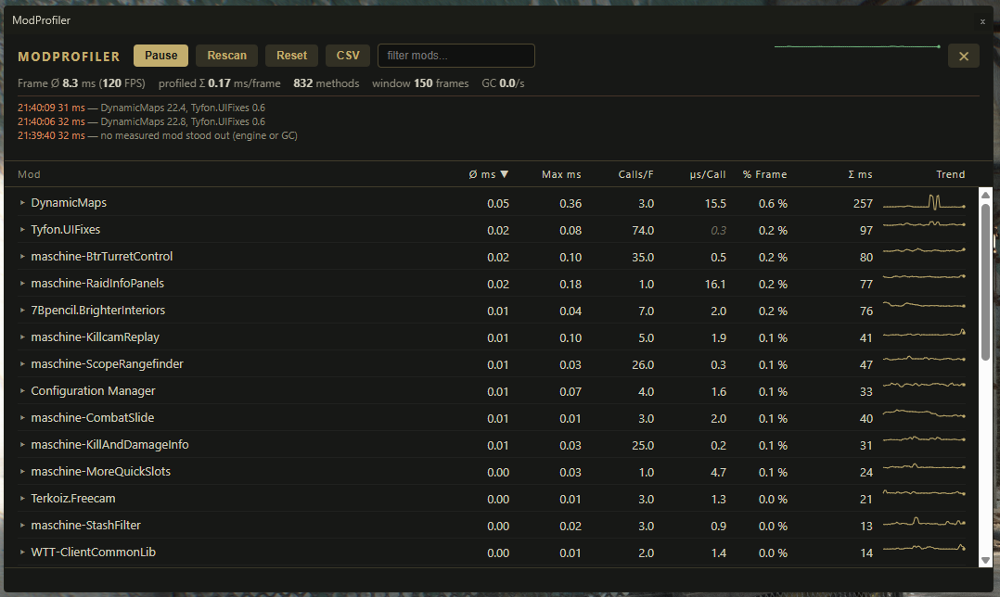
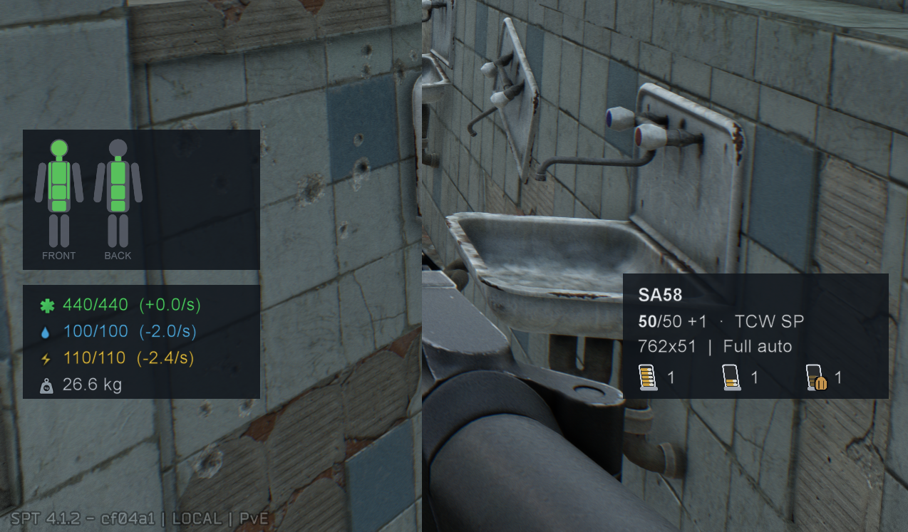

# SPT 4.1 – Beta Mods

Overview of all mods in beta testing · Last updated: **2026-08-15 22:24** · 13 mods with download, 5 in development.

This page only lists mods that are **not (yet) released on [Forge](https://sp-mod.com/)** — released mods get their updates there.

**Installation:** Grab the ZIP via the download link and extract it into the SPT root folder
(the folder containing `EscapeFromTarkov.exe`), overwriting existing files.
The ZIPs contain the correct folder structure: client mods go to `BepInEx\plugins\`,
server mods to `SPT_Runtime\user\mods\`. For **Client + Server** mods both parts are in the ZIP
and both must be installed.

**Build ID:** Dev builds do not always get a new version number – the unique identifier is
the part after the `+` (commit ID or file hash), e.g. `1.2.0+7b65898`.
Please always include it when reporting issues.

| Mod | Version | Updated | Type | Description | Preview | Download |
|---|---|---|---|---|---|---|
| [**BangAndClear**](#bangandclear) | `0.9.0+3111b16` | 2026-08-11 | Client | An SPT 4.0 client mod for tactical door work: crack a door open a few degrees, put a grenade through the gap, close the door, wait for the bang. | – | [⬇ ZIP](https://github.com/maschine34675/spt-beta-hub/raw/main/downloads/BangAndClear-0.9.0-3111b16.zip) |
| [**BtrTurretControl**](#btrturretcontrol) | `1.0.0+37e08ef` | 2026-08-14 | Client | Client-only SPT mod that lets a seated BTR passenger take direct control of the gun turret. | – | [⬇ ZIP](https://github.com/maschine34675/spt-beta-hub/raw/main/downloads/BtrTurretControl-1.0.0-37e08ef.zip) |
| [**ClusterGrenade**](#clustergrenade) | `2.2.1+5fe2678` | 2026-08-13 | Client + Server | Cluster grenade for SPT: instead of shrapnel, the explosion releases several impact bomblets (frag or flash, weighted mix). Also adds a 40x46mm cluster round for grenade…<br><sub>🔌 requires <a href="https://sp-mod.com/mod/2310/wtt-commonlib">WTT - CommonLib</a></sub> | – | [⬇ ZIP](https://github.com/maschine34675/spt-beta-hub/raw/main/downloads/ClusterGrenade-2.2.1-5fe2678.zip) |
| [**CombatSlide**](#combatslide) | `2.0.0+c57f2f8` | 2026-08-09 | Client | Press crouch while sprinting to keep sliding at decreasing speed – a "combat slide" like in other shooters. | – | [⬇ ZIP](https://github.com/maschine34675/spt-beta-hub/raw/main/downloads/CombatSlide-2.0.0-c57f2f8.zip) |
| [**CorpseRun**](#corpserun) | `0.9.0+0a62fa2` | 2026-08-14 | Client + Server | After dying in a raid, optionally respawn (naked), loot your own corpse and continue the raid; giving up ends the raid normally. | – | [⬇ ZIP](https://github.com/maschine34675/spt-beta-hub/raw/main/downloads/CorpseRun-0.9.0-0a62fa2.zip) |
| [**KillAndDamageInfo**](#killanddamageinfo) | `0.9.0+6554e72` | 2026-08-15 | Client | KillAndDamageInfo shows the combat information the game keeps to itself: what your kills died to, who killed you and in what state they were, what each hit actually did… | – | [⬇ ZIP](https://github.com/maschine34675/spt-beta-hub/raw/main/downloads/KillAndDamageInfo-0.9.0-6554e72.zip) |
| [**Killcam**](#killcam) | `1.0.0+aec3dc4` | 2026-08-09 | Client | "Killcam light": on death the camera switches to the killer's first-person view for about 6 seconds; the death panel shows the killer's name and remaining HP. | – | [⬇ ZIP](https://github.com/maschine34675/spt-beta-hub/raw/main/downloads/Killcam-1.0.0-aec3dc4.zip) |
| [**KillcamReplay**](#killcamreplay) | `0.9.2+8dd53d0` | 2026-08-14 | Client | True killcam: on death, the killer's final moments are replayed from their point of view, based on the recorded movement of the last seconds before the kill. | – | [⬇ ZIP](https://github.com/maschine34675/spt-beta-hub/raw/main/downloads/KillcamReplay-0.9.2-8dd53d0.zip) |
| [**ModProfiler**](#modprofiler) | `2.0.0+e12e624` | 2026-08-15 | Client | In-game profiler modeled after Dubs Performance Analyzer (RimWorld): shows live how much CPU time each installed client mod costs per frame – find the cause of…<br><sub>🔌 requires <a href="https://sp-mod.com/mod/2879/weboverlay">WebOverlay</a></sub> | <a href="#modprofiler"></a> | [⬇ ZIP](https://github.com/maschine34675/spt-beta-hub/raw/main/downloads/ModProfiler-2.0.0-e12e624.zip) |
| [**ModSourceDebugger**](#modsourcedebugger) | `2.0.0+7371199` | 2026-08-15 | Client + Server | Debugging tool: traces item templates and UI elements back to the mod that added them (tooltips + UI inspector). | – | [⬇ ZIP](https://github.com/maschine34675/spt-beta-hub/raw/main/downloads/ModSourceDebugger-2.0.0-7371199.zip) |
| [**QuestMarkers**](#questmarkers) | `0.1.0+393f10d` | 2026-08-15 | Client | World-anchored HUD markers for your unfinished quest objectives: zones to visit, spots to place items or beacons at, and quest items lying in the raid. No more running…<br><sub>🔌 requires <a href="https://sp-mod.com/mod/2879/weboverlay">WebOverlay</a></sub> | <a href="#questmarkers"></a> | [⬇ ZIP](https://github.com/maschine34675/spt-beta-hub/raw/main/downloads/QuestMarkers-0.1.0-393f10d.zip) |
| [**RaidInfoPanels**](#raidinfopanels) | `1.0.0+c7ec48b` | 2026-08-15 | Client | Stable replacement for the GamePanelHUD weapon/health panels on SPT 4.x. | <a href="#raidinfopanels"></a> | [⬇ ZIP](https://github.com/maschine34675/spt-beta-hub/raw/main/downloads/RaidInfoPanels-1.0.0-c7ec48b.zip) |
| [**SurroundAudio**](#surroundaudio) | `1.0.0+a29569c` | 2026-08-14 | Client | Experimental proof of concept: plays SPT on a real surround speaker setup (5.1/7.1) instead of binaural headphone audio. | – | [⬇ ZIP](https://github.com/maschine34675/spt-beta-hub/raw/main/downloads/SurroundAudio-1.0.0-a29569c.zip) |

## 🚧 In development – no build yet

| Mod | Type | Description |
|---|---|---|
| **AdaptiveArsenal** | Server | Adaptive Arsenal is an SPT 4.0 C# server mod prototype that tracks equipment usage after raids. |
| **AiStoryQuests** | Client + Server | Experiment: AI-generated story quests (providers: OpenAI/Anthropic/Ollama, own API key required). |
| **AutoWishlist** | Client + Server | – |
| **StashSort** | Client | – |
| **UnloadAllMagazinesInventory** | Client | Adds an unload all magazines button that can be used in raid to each inventory slot. |

---

## BangAndClear

**Type:** Client · **Version:** `0.9.0+3111b16` · **Updated:** 2026-08-11 12:08 · [⬇ Download](https://github.com/maschine34675/spt-beta-hub/raw/main/downloads/BangAndClear-0.9.0-3111b16.zip)

<details><summary><b>Show usage notes</b></summary>

An SPT 4.0 client mod for tactical door work: crack a door open a few degrees, put a grenade
through the gap, close the door, wait for the bang.

No new animations - EFT doors rotate procedurally, so the crack reuses the vanilla door curve
and hand animation, and the throw is the vanilla underhand toss.

#### Door actions

- **Bang & clear** - the full maneuver as one action: cracks the door (if it isn't already),
  pulls up your top-priority grenade, aims at the gap, underhand-throws it through and closes
  the door again. Replaces the permanently disabled "Bang & clear" stub BSG left in the menu.
  Greyed out when you carry no grenade.
- **Crack Open** - just open the door ~15° and leave it. For AI and game logic the door still
  counts as closed. Throw manually, peek, listen.
- **Close Crack** - close a cracked door (full open also works from the cracked state).

#### Config (F12)

| Setting | Default | Description |
|---|---|---|
| Enabled | true | Add the actions to door menus. |
| CrackAngleDegrees | 15 | How far the door swings open when cracked. |
| CrackSpeed | 1.0 | Speed multiplier for the crack movement. |
| SqueakVolume | 0.35 | Volume of the squeak while cracking. |
| AutoCloseDoor | true | Bang & clear closes the door after the throw. |
| CloseDelaySeconds | 1.5 | Delay between the grenade leaving the hand and the door closing. |
| IgnoreDoorCollision | true | The scripted throw can't bounce back off the door leaf (frame/walls still block). |
| GuidedThrow | true | Redirect the toss through the gap regardless of standing position (speed kept, direction corrected). |
| AimSpeedDegPerSec | 360 | Turn speed of the scripted aim toward the gap. |
| AimHeightMeters | 0.9 | Aim height above your feet; lower rolls, higher tosses. |

#### Notes & compatibility

- Cracked doors keep `EDoorState.Shut`, so bots treat them as closed and will open them
  normally when pathing through - no bots bumping into half-open doors.
- The door's occlusion portal is kept open while cracked so the room behind the gap renders.
- Locked doors, sliding doors, keycard doors and exfil doors are excluded.
- Bang & clear uses the regular grenade hands controller (the vanilla quick-throw controller
  only supports the overhand toss), so the character really draws the grenade, underhand-throws
  it and returns to the weapon - all vanilla animations and voice lines.
- A grenade already held in the hands is used directly - even with the pin pulled for an
  overhand throw (the toss then goes overhand instead of underhand).
- Otherwise the grenade is picked like vanilla quick throw: quickslot priority grenade first,
  then the grenade slots.
- The door close is anchored to the moment the grenade actually leaves the hand, plus
  CloseDelaySeconds.
- Breaching a cracked door snaps it shut for a frame before the kick (vanilla kick curve
  starts at the closed angle) - cosmetic only.
- SPT single player only for now. In Fika co-op the crack angle is not synced to other clients.

#### Install

Drop `maschine-BangAndClear.dll` into `BepInEx/plugins/`.

</details>

---

## BtrTurretControl

**Type:** Client · **Version:** `1.0.0+37e08ef` · **Updated:** 2026-08-14 17:24 · [⬇ Download](https://github.com/maschine34675/spt-beta-hub/raw/main/downloads/BtrTurretControl-1.0.0-37e08ef.zip)

<details><summary><b>Show usage notes</b></summary>

Client-only SPT mod that lets a seated BTR passenger take direct control of the gun turret.

#### Current state (v0.1.2 skeleton)

- Toggle turret mode with `F` (configurable) while `Inside` the BTR
- Scroll-wheel interaction entry: `BTR Turret: Operate` / `BTR Turret: Exit`
- Mouse aim drives `BTRTurretServer.targetPosition`
- Left mouse button fires through the existing `shooterBTR` gunner bot
- Main FPS camera is temporarily mounted to `machineGunLaunchPoint`
- Debug spawn: skips the vanilla 5-10 minute BTR timer and starts the route from the real enter point
- Manual debug hotkey: `F7` forces spawn if the BTR is not active yet

The BTR depot is intentionally off-map at roughly `(1000, 0, 1000)`. That is only a staging area. When spawn works correctly, `MoveEnable()` teleports the vehicle to the configured route enter point (for example `p7` on Streets) and the client view is synced there.

#### Build

```powershell
dotnet build BtrTurretControl.csproj -c Release
```

The DLL is copied to `BepInEx\plugins\` automatically.

#### Config

`BepInEx\config\com.maschine.BtrTurretControl.cfg`

- `ToggleTurretKey` (default `F`)
- `MouseSensitivity`
- `AllowFireWhileMoving` (default `false`)
- `InstantSpawnOnRaidStart` (default `true`, disable for normal BTR timing)
- `ForceSpawnBtrKey` (default `F7`)
- `MinBootstrapWaitSeconds` (default `3`)
- `FallbackSpawnAfterSeconds` (default `8`)
- `LogSpawnDiagnostics` (default `true`)

#### Known limitations

- Turret mode auto-exits while the BTR is driving unless `AllowFireWhileMoving` is enabled
- Interaction label is hardcoded English (no locale entry yet)
- Camera restore may need more work with third-person / optic states
- Friendly-fire / betrayal rules are unchanged

#### Next steps

- HUD crosshair overlay for turret view
- Hold turret mode across short BTR pauses at destinations
- Optional localization key for the interaction prompt

</details>

---

## ClusterGrenade

**Type:** Client + Server · **Version:** `2.2.1+5fe2678` · **Updated:** 2026-08-13 19:00 · [⬇ Download](https://github.com/maschine34675/spt-beta-hub/raw/main/downloads/ClusterGrenade-2.2.1-5fe2678.zip)

> 🔌 **Requires:** [WTT - CommonLib](https://sp-mod.com/mod/2310/wtt-commonlib) — install separately, not included in the ZIP.

**Components:** Client `2.2.1+5fe2678` · Server `2.2.1+5fe2678`

<details><summary><b>Show usage notes</b></summary>

### ClusterGrenade Mod

Cluster grenade for SPT: instead of shrapnel, the explosion releases several impact-fuzed bomblets (frag or flash, weighted mix). There is also a 40x46mm cluster round for grenade launchers (MSGL, M203, FN40GL).

#### Components

| Part | Path |
|------|------|
| Client mod (BepInEx) | `ClusterGrenade.Client/` |
| Server mod (SPT + WTT) | `ClusterGrenade.Server/` |
| Server item | `SPT_Runtime/user/mods/ClusterGrenade/db/CustomItems/ClusterGrenade.json` |

**Item ID:** `67d4f0c8a1b2e30123456789`

#### How WTT-ServerCommonLib + JSON fit together

**WTT-ServerCommonLib is a library, not an auto-loader.** It does not scan all `user/mods/*/db/CustomItems/` folders.

| Component | Role |
|------------|--------|
| `WTT-ServerCommonLib.dll` | Shared library (API for loading items/locales/loot) |
| `WTT-PackNStrap.dll` | **Content mod** — calls `CreateCustomItems()` on startup and reads JSON **only** from its own mod folder |
| `db/CustomItems/*.json` | Data — only loaded if **your** server DLL reads it |

That is why the JSON works in `WTT-PackNStrap/db/CustomItems/` (where `WTT-PackNStrap.dll` lives), but not on its own in `ClusterGrenade/` without a server DLL.

#### Installation

##### 1. Server mod

The folder `SPT_Runtime/user/mods/ClusterGrenade/` needs **both**:

```
ClusterGrenade/
├── maschine-ClusterGrenade.Server.dll    ← loads the JSON
└── db/CustomItems/
    └── ClusterGrenade.json
```

**Prerequisite:** [WTT-ServerCommonLib](https://github.com/WelcomeToTarkov/WTT-CommonLib) must be installed (`com.wtt.commonlib`).

Build both projects (without touching the live SPT install):

```powershell
cd C:\SPT\Development\ClusterGrenade
dotnet build .\ClusterGrenade.slnx -c Release
```

The outputs then live under `ClusterGrenade.Client/bin/Release/` and
`ClusterGrenade.Server/bin/Release/`. To deliberately build and install both
components:

```powershell
dotnet build .\ClusterGrenade.slnx -c Release -p:DeployToSpt=true -p:SptRoot=C:\SPT
```

This copies `maschine-ClusterGrenade.Client.dll` to `BepInEx/plugins/` and
`maschine-ClusterGrenade.Server.dll` plus the item JSON to
`SPT_Runtime/user/mods/ClusterGrenade/`.

##### 2. Testing

1. Restart the SPT server
2. Start the game
3. Buy the cluster grenade from Skier (LL2, ~18,500 ₽) or spawn it via give-ui
4. Throw it and watch: on detonation, sub-grenades (RGO with impact fuze) fly in all directions

#### Configuration

`BepInEx/config/com.maschine.ClusterGrenade.cfg`

| Setting | Default | Description |
|-------------|----------|--------------|
| `Enabled` | `true` | Mod on/off |
| `ClusterGrenadeTemplateId` | `67d4f0c8a1b2e30123456789` | Must match the server item ID |
| `SubGrenadeCount` | `8` | Number of sub-grenades (1–24) |
| `ScatterForce` | `6` | Scatter impulse |
| `UpwardForce` | `3` | Upward impulse |

##### Bomblet selection

Each sub-grenade is rolled individually at throw time using the current weights (no restart needed, adjustable live in the BepInEx F12 menu under the "Bomblets" section):

| Setting | Default | Description |
|-------------|----------|--------------|
| `FragBombletTemplateId` | `67d4f0c8a1b2e3012345678c` | Frag bomblet (impact fuze, shrapnel damage) |
| `FlashBombletTemplateId` | `67d4f0c8a1b2e3012345678d` | Flash bomblet (impact fuze, blinds/stuns, no damage) |
| `FragBombletWeight` | `70` | Relative weight (0–100) for frag bomblets |
| `FlashBombletWeight` | `30` | Relative weight (0–100) for flash bomblets |

A weight of `0` effectively disables a type, `100` makes the selection deterministic.

##### 40mm cluster round

The 40x46mm cluster round (M381 clone, at Skier LL2, ~8,500 ₽) spreads bomblets on impact using the same weights as the hand grenade. It fits all 40x46 launchers (MSGL drum, M203, FN40GL); the GP-25 uses a different caliber (40mmRU) and is not covered.

| Setting | Default | Description |
|-------------|----------|--------------|
| `ClusterShellTemplateId` | `67d4f0c8a1b2e3012345678e` | Must match the server item ID |
| `ShellSubGrenadeCount` | `5` | Number of sub-grenades per 40mm impact (1–24) |

##### Explosive and flash ammunition

For seven common calibers (9x19, 5.45x39, 5.56x45, 7.62x39, 7.62x51, 7.62x54R, 12/70) there is one **explosive round** (HE, red tracer) and one **flash round** (flash, green tracer) each — all at Skier LL2:

- **HE:** Normal bullet plus an explosion on impact (fragments + blast). The fuze only arms after ~7 m of flight — below that you only get the bullet damage.
- **Flash:** Deals no damage at all, but blinds and stuns anyone looking towards the impact (vanilla Zvezda mechanic).

Both are purely server-side (no client logic) and work in any weapon that fires the respective base caliber.

#### Technical notes

- **Server:** The cluster grenade/bomblets are RGD-5 clones, the 40mm round is an M381 clone with `FragmentsCount: 0` and `ExplosionStrength: 0`; WTT's `addCaliberToAllCloneLocations` registers the round in all 40x46 filters
- **Client:** A Harmony postfix on `Grenade.Explosion()` (thrown grenade) or `ClientGameWorld.ShotDelegate()` (40mm impact) spawns sub-grenades via `GrenadeFactory.Create()`

</details>

---

## CombatSlide

**Type:** Client · **Version:** `2.0.0+c57f2f8` · **Updated:** 2026-08-09 12:53 · [⬇ Download](https://github.com/maschine34675/spt-beta-hub/raw/main/downloads/CombatSlide-2.0.0-c57f2f8.zip)

_No detailed description yet._

---

## CorpseRun

**Type:** Client + Server · **Version:** `0.9.0+0a62fa2` · **Updated:** 2026-08-14 10:03 · [⬇ Download](https://github.com/maschine34675/spt-beta-hub/raw/main/downloads/CorpseRun-0.9.0-0a62fa2.zip)

**Components:** Client `0.9.0+0a62fa2` · Server `0.9.0+119da90`

_No detailed description yet._

---

## KillAndDamageInfo

**Type:** Client · **Version:** `0.9.0+6554e72` · **Updated:** 2026-08-15 13:40 · [⬇ Download](https://github.com/maschine34675/spt-beta-hub/raw/main/downloads/KillAndDamageInfo-0.9.0-6554e72.zip)

<details><summary><b>Show usage notes</b></summary>

KillAndDamageInfo shows the combat information the game keeps to itself: what
your kills died to, who killed you and in what state they were, what each hit
actually did — and a full per-raid statistics window on a hotkey.

#### Features

**Raid-end kill list**

- Every kill entry additionally shows the ammunition used.
- Targets you damaged but did not kill get their own **Damaged** entries with
  total damage, hit count and armor penetrations — so an almost-kill no longer
  looks like a miss.

**Death screen**

- The "killed by" line is extended with the killer's weapon, ammunition and
  distance.
- The killer's **remaining HP** is shown next to their name — see how close
  the fight really was.
- The 3D character model shows **the killer with their equipment** instead of
  your own character, including their level badge (hidden for Scavs, as in the
  vanilla kill list).

**Post-raid treatment screen**

- Body-part damage tooltips additionally show the weapon and the distance of
  the hits.

**Raid analysis overlay** (default key: F7, rebindable)

- **Heatmap** — a body silhouette with color-coded zones showing where you got
  hit and where you hit others, with hit counts and damage per zone.
- **Ammo** — per ammunition type: shots fired, hits, accuracy, armor
  penetration rate, average and total damage.
- **Weapons** — per weapon: shots, hits, accuracy, damage and kills.
- **Distance** — a bar chart of your hits grouped by engagement range.
- **Overview** — totals for both directions, damage your armor absorbed,
  bullets that ricocheted off you (including helmet ricochets — in the vanilla
  game those are nearly indistinguishable from a near miss), accuracy,
  headshot rate and penetration rates.
- **Records** — per-raid highlights: longest hit, hardest hit dealt and
  taken, most hits on one target.
- Everything is shown separately for damage **received** and **dealt**, and
  weapon fire is blocked while the mouse is over the window.

Every feature group can be disabled individually in the configuration.

#### Requirements and compatibility

- SPT 4.1.x (developed and tested on 4.1.1).
- Client-only BepInEx plugin — no server component, no profile changes.
- No dependencies beyond a standard SPT install.
- Statistics cover the whole raid even when another mod lets you die and
  respawn more than once per raid.
- Fika: not tested in Fika sessions.

#### Installation

Extract the release ZIP into your SPT installation directory. The plugin ends
up at:

`BepInEx/plugins/maschine-KillAndDamageInfo.dll`

To remove the mod, delete that file.

#### Usage

- Play normally — the kill list, death screen and treatment screen additions
  appear automatically after a raid.
- Press **F7** (rebindable) during or after a raid to open the raid analysis
  window. Switch tabs at the top, toggle between **Received** and **Dealt** at
  the top right, and drag the title bar to move the window. Statistics reset
  when the next raid starts.
- Options live in `BepInEx/config/com.maschine.KillAndDamageInfo.cfg` and can
  also be changed in-game with a configuration manager: the overlay key and
  one on/off switch per feature group (kill list ammo, damaged targets, death
  screen details, killer 3D model, damage tooltips, analysis overlay).

#### Known limitations

- Statistics are per raid only; there is no career/long-term aggregation.
- Accuracy counts individual projectiles, so every shotgun pellet counts as
  one shot. Melee and grenade hits carry no ballistics data and are excluded
  from shot counts and accuracy (shown as "—").
- Penetration rate only counts hits where armor was actually involved; pure
  flesh hits do not distort the number.
- "Shots" and "Hits" come from two different game systems; in rare cases (for
  example one bullet passing through two body parts) the columns can disagree
  by a hit while the accuracy percentage stays consistent.
- Deaths without an attacker (falls, bleed-outs, mines) show the vanilla death
  screen — there is no killer to display.

#### Support

Please report problems with:

- exact KillAndDamageInfo and SPT versions;
- what you expected and what happened instead;
- short reproduction steps (which screen, which tab);
- your `BepInEx/LogOutput.log` from the session.

#### License

MIT — see [LICENSE](LICENSE).

</details>

---

## Killcam

**Type:** Client · **Version:** `1.0.0+aec3dc4` · **Updated:** 2026-08-09 12:56 · [⬇ Download](https://github.com/maschine34675/spt-beta-hub/raw/main/downloads/Killcam-1.0.0-aec3dc4.zip)

> **Tester note:** Predecessor of **KillcamReplay** – do not install both at the same time.

_No detailed description yet._

---

## KillcamReplay

**Type:** Client · **Version:** `0.9.2+8dd53d0` · **Updated:** 2026-08-14 09:14 · [⬇ Download](https://github.com/maschine34675/spt-beta-hub/raw/main/downloads/KillcamReplay-0.9.2-8dd53d0.zip)

> **Tester note:** Successor of **Killcam** – do not install both at the same time.

<details><summary><b>Show usage notes</b></summary>

GUID `com.maschine.KillcamReplay`, Assembly `maschine-KillcamReplay` — naming scheme as in
[EasyMounting](https://github.com/maschine34675/EasyMounting).

A true killcam for SPT: on death, the final action is played back **from the killer's point
of view** — not a live view of the killer (as in KillAndDamageInfo), but a replay of the
recorded view direction and position of the last seconds before the kill.

#### How it works

**Recording (during the raid):**
A `SnapshotRecorder` samples at a fixed rate (default 20 Hz), for every living player/bot,
the camera position (`Player.CameraPosition`), view direction (`Player.Rotation`, yaw/pitch),
body pose (`PoseLevel`, `IsInPronePose`) and the world pose of the held weapon
(`PlayerBones.WeaponRoot.Original`) into a ring buffer (default 15 s). Shots are marked with
a timestamp via a postfix on `Player.OnMakingShot`. During the replay, a script-free mesh
copy of the killer's weapon (`WeaponGhost`) travels along its recorded track in front of the
camera — you can see what he aims with and where; the muzzle flash sits at its muzzle.

**Replay (on death):**
`Player.OnDead` provides the killer (`LastAggressor`). The window of the last N seconds
(default 5 s) is extracted from his ring buffer. `LocalGame.Stop()` is deferred (same
pattern as the KillAndDamageInfo killcam) and the main camera is interpolated along the
recorded path (position: lerp, yaw/pitch: LerpAngle). The pose is applied in
`Application.onBeforeRender` — after all `LateUpdate`s, so the still-running
`PlayerCameraController` (corpse cam) cannot overwrite the rendered image. Deliberately,
**no** controller is destroyed or created: `PlayerCameraController.Destroy` detaches the
`EffectsController` from the player, whose death handler then throws NullRefs and aborts the
end-of-raid sequence (soft lock). The death fade (`EffectsController.method_9`,
DeathFade + FastBlur) is suppressed via prefix during the replay, otherwise it would sit
black on top of it.

**Slow motion:**
The last `SlowMoSeconds` (default 1.5 s) before the kill run in slow motion
(`SlowMoFactor`, default 0.35×) — purely via the playback clock, no `Time.timeScale`;
the live world keeps running normally. Smooth transition over 0.4 s when entering the window.
The deferred-stop delay accounts for the stretched wall-clock time.

**Soft ending (live tail):**
At the end of the recorded path (the kill moment) the replay does not end abruptly: a short
fade to black (~0.2 s), under full black the scene switches to the live world (puppet
removed, hidden bots and your own corpse visible again — only the killer stays hidden),
fade back, then the camera follows **the killer's eyes live** for `LiveTailSeconds`
(default 2 s) (`FollowKillerInTail`; fallback: last replay position if he has died in the
meantime). Afterwards the replay itself fades to black and holds black until the re-invoked
`LocalGame.Stop` has raised its own blackscreen (detected via
`DeferStopPatch.StopReinvokedAt` + 1.5 s; emergency timeout 5 s) — so the corpse cam never
flashes up between replay end and the end-of-raid transition. During the live tail the
killer himself stays hidden (the camera sits in his eyes), but his **held weapon is shown
again** (`LivePlayerHider.ShowHeldWeapon`) — it rides on his live hands and reads like a
natural first-person view; weapon views newly created while reloading also stay visible
(excluded from the refresh sweep). If `Stop` was not deferred (e.g. because a respawn mod
intercepted the death), the camera is returned directly after the tail — no black hold,
which would otherwise cover the respawn prompt. In the F9 debug replay the tail is
deliberately disabled (the player is alive and would be blind for that long).

**Victim ghost (phase 2/3):**
During the replay you watch yourself through the killer's eyes. Two representations:

- **Real character model** (`GhostPuppet`, default): The `BoneRecorder` records the
  complete skeleton of the local player (only the local player — which is what keeps it
  affordable: ~a few hundred transform reads per tick, flat preallocated arrays, a few MB).
  On replay the corpse is cloned — `Corpse.CreateCorpse` converts the real, dressed player
  GameObject in place, so the clone wears clothing + gear. Before stripping, every renderer
  on the clone is forced to `shadowCastingMode = On` — otherwise head/upper body stay
  invisible, because EFT renders them on your own player in first person with
  `ShadowCastingMode.ShadowsOnly` (the corpse conversion never resets that) and a raw clone
  copies this state along. The obvious route via
  `PlayerBody.UpdatePlayerRenders(ThirdPerson, ...)` — the game's own method for this — does
  NOT work on the clone: it iterates `PlayerBody.BodySkins`, which is only populated at
  runtime (Awake/Equip) and is empty on a clone whose Awake we deliberately never run
  (silent no-op, no error). The direct renderer sweep bypasses that entirely. The clone is
  instantiated under an INACTIVE holder (no Awake runs), all scripts/physics/animator are
  stripped via `DestroyImmediate` (no Awake → no OnDestroy side effects), bones are mapped
  by hierarchy path and overwritten per frame with the recorded poses — **no animator
  needed**, exact playback of gait, lean and aiming. The source (corpse or live body) is
  hidden after cloning so it does not stay visible next to the running ghost.
- **Silhouette** (`ReplayGhost`, automatic fallback): capsule body with pose-dependent
  height, head sphere, view-direction bar — in case puppet creation fails or
  `UseRealModelGhost` is off.

In the F9 debug replay the ghost is your own path (puppet source = living body; your own
head stays invisible there for FPS reasons): stand in front of a bot, F9, watch yourself.

#### Performance budget

- **Idle cost per frame:** 2 float comparisons (sample not due → early-out).
- **Per sample tick (20×/s):** per living player 1 transform read + 1 Vector2 read +
  1 struct write into a preallocated array. With ~30 bots: microsecond range.
- **No GC allocations in the hot path:** ring buffers are preallocated (structs), the
  track dictionary only grows when a new player spawns. Extracting the replay window
  allocates only once, on death.
- **Memory:** 32 bytes/snapshot × 20 Hz × 15 s ≈ 9.6 KB per player; with 40 players ≈ 385 KB.
  The bone recorder (local player only) takes a few MB depending on skeleton size
  (logged at raid start).

#### Configuration (BepInEx F12 / config file)

| Option | Default | Description |
|---|---|---|
| Recording.SampleRate | 20 Hz | Recording rate |
| Recording.BufferSeconds | 15 s | Ring buffer length |
| Replay.Duration | 10 s | Replay length |
| Replay.LiveTailSeconds | 5 s | Keep showing live after replay end (0 = off) |
| Replay.SlowMoSeconds | 1.5 s | Play the last N seconds before the kill in slow motion (0 = off) |
| Replay.SlowMoFactor | 0.35 | Playback speed inside the slow-motion window |
| Replay.FollowKillerInTail | true | Follow the killer live during the tail instead of staying static |
| Replay.HudTopFraction | 0.87 | Vertical position of the killcam HUD (fraction of screen height from the top) |
| Replay.ShowMuzzleFlashes | true | 3D muzzle flashes at recorded shot timestamps |
| Replay.ShowKillerWeapon | true | Mesh copy of the killer's weapon travels its recorded track in front of the camera |
| Replay.DeathReplay | true | Replay on your own death |
| Replay.ShowVictimGhost | true | Show your own silhouette (ghost) in the replay |
| Replay.UseRealModelGhost | true | Real character model instead of silhouette (automatic fallback) |
| Replay.HideLiveBots | true | Hide living bots during the replay |
| Replay.InvertPitch | false | Invert vertical view direction (in case the camera tilts the wrong way) |
| Debug.ReplayKey | F9 | Immediately play a replay of the nearest bot (testing without dying) |

#### Known limitations (prototype)

- **The world keeps running live** — living bots (including the killer) are hidden during
  the replay though (`LivePlayerHider`: `Renderer.enabled`, AI/logic keep running; restored
  afterwards). Equipment views (weapon, chest rig, backpack, headwear, ...) are pooled
  objects (`AssetPoolObject`) attached to a bone — not guaranteed to be descendants of
  `player.gameObject` — so `PlayerBody.SlotViews` (the game's own authoritative list of
  every currently equipped view) is traversed additionally and its `Renderers` are hidden
  explicitly. The weapon **in the hands** is NOT a SlotView model (the slot suppresses its
  body model while the item is held) — it is a separate view object of the hands controller
  under the `WeaponRoot` bone and is swept separately. A flashlight moreover is not a
  renderer but a `UnityEngine.Light` component (typically sitting on the hand weapon) that
  keeps shining when only the mesh is hidden — so all `Light` components (player hierarchy,
  slots, WeaponRoot) are disabled as well. Your own corpse/live body (the puppet source) is
  also hidden as soon as the clone is up. Additional actors as ghosts (e.g. the killer in a
  third-person view) would be a later extension.
- **Muzzle flash = approximation** — at recorded shot timestamps a point light + stretched
  glow ellipsoid appears in shot direction for ~70 ms (`ShotFlash`; Unity has no cone
  primitive): killer shots just in front of/below the camera (his eyes ARE the camera, his
  weapon is not rendered), own shots at the estimated muzzle of the puppet weapon (furthest
  +Z extent of the copied meshes). No particle effect, no sound. Can be disabled via
  `ShowMuzzleFlashes`.
- **Hidden bots are re-swept every 0.5 s** (`RefreshHidden`): reloading and weapon switching
  create NEW view objects mid-replay (magazine in the hand, round, different weapon) that
  did not exist at the initial hide and would otherwise be visible, floating freely.
- **The Odin NullRef on corpse cloning is no longer logged**: it comes from the item scripts
  of the slot-view equipment (holster/back weapon), is demonstrably without consequence
  (the components are stripped right afterwards) — the Unity logger is muted exactly for the
  synchronous `Instantiate` call.
- **The "Killed in Action" panel** appears as a UI overlay on top of the replay (as with the
  KillAndDamageInfo killcam).
- **Weapon on the puppet = pure mesh copy**: the Odin/Sirenix deserialization of the weapon
  item throws an (internally caught) NullReferenceException on raw cloning and leaves the
  weapon mesh empty. So the weapon is not cloned at all; its meshes are copied individually
  (`AttachWeaponMeshes`: new GameObjects with sharedMesh + sharedMaterials, without any
  scripts) and attached to the puppet's mapped WeaponRoot bone — they ride on the recorded
  hand animation. Skinned meshes (e.g. straps) are skipped; moving weapon parts (bolt etc.)
  are static in the copy.
- **Coexistence with KillAndDamageInfo:** its live killcam also owns the death sequence
  (deferred stop + camera takeover). If that mod is loaded, the death replay disables itself
  automatically (log warning); the F9 debug replay still works. To test the death replay,
  temporarily remove the KillAndDamageInfo DLL from `BepInEx/plugins`.
- **Respawn compatibility (e.g. CorpseRun):** recording is deliberately NOT stopped
  permanently on your own death (only during the ~10 s a replay actively occupies the
  screen) — otherwise recording would end for good after the first death and every further
  replay in the same round would fail with "Killer track too short". The `BoneRecorder`
  detects a character switch (new player GameObject after respawn) and reinitializes itself
  automatically. Verified in-game with CorpseRun (multiple deaths/replays in one round).

#### Build

```
dotnet build -c Debug
```

Automatically copies DLL + PDB to `C:\SPT\BepInEx\plugins\`.

</details>

---

## ModProfiler

**Type:** Client · **Version:** `2.0.0+e12e624` · **Updated:** 2026-08-15 20:45 · [⬇ Download](https://github.com/maschine34675/spt-beta-hub/raw/main/downloads/ModProfiler-2.0.0-e12e624.zip)

> 🔌 **Requires:** [WebOverlay](https://sp-mod.com/mod/2879/weboverlay) — install separately, not included in the ZIP.


<details><summary><b>Show usage notes</b></summary>

In-game profiler for SPT modeled after **Dubs Performance Analyzer** (RimWorld):
shows live how much CPU time each installed client mod costs per frame — to find the
culprit behind performance drops without having to disable mods one by one.

#### Usage

- **F10** (configurable): open/close the profiler. The first activation instruments
  all mod code and can freeze the game for a few seconds — that is normal.
- If the [Anvil-WebOverlay](https://github.com/maschine34675/WebOverlay) library is
  installed, the profiler opens as **its own window on top of the game** (HTML UI):
  draggable with remembered position/size, sorting via column headers, filter field,
  per-mod trend sparklines and a frame history in the header. **Esc** or the toggle key
  closes it. A mouse mode is unnecessary here: while the window has focus it captures
  mouse and keyboard itself; one click into the game returns both.
- Without the library — or with `UI/PreferWebOverlay = false` — the previous
  **IMGUI overlay** appears. There, the mouse cursor is left untouched on opening and you
  can keep playing normally. **F11** (configurable) or the "Mouse" button activates
  mouse mode: cursor free, all game controls blocked (shooting, movement, mouse look),
  so you can safely click inside the window. F11 again → back to the game.
  In menus (cursor already free), hovering over the window is enough: clicks then no
  longer reach the game UI underneath.
- Table: one row per mod with **avg ms/frame**, **max ms**, **calls/frame**, **% frame**
  and **Σ ms** (accumulated since activation). Clicking a column header sorts.
  The web window additionally shows **µs/call** (average cost of a single call):
  values close to 1 µs consist mostly of the measurement overhead of the instrumentation
  itself — such rows are grayed out, and their ranking is not reliable either.
  All column headers, metrics and buttons explain themselves via tooltips.
- Clicking a mod name expands the mod's most expensive methods
  (`[H]` Harmony patch, `[U]` Unity frame method, `[C]` coroutine/async).
- The web window's header also shows the **GC rate** (collections per second; amber
  ticks on the frame graph mark intervals in which a collection ran), and a **spike
  log** records frames slower than `UI/SpikeThresholdMs` (default 30 ms, and at least
  1.5× the current average) together with the top measured contributors of that exact
  frame — a spike without contributors points at the engine or the GC.
- **Pause/Resume**: stop measuring, window stays open. **Rescan**: picks up patches
  created later (e.g. at raid start — press it once during the raid!).
  **Reset**: zero the counters. **CSV**: export to
  `BepInEx/plugins/maschine-ModProfiler/modprofiler-<time>.csv`.

#### What is measured

1. **Harmony patches**: every prefix/postfix/finalizer method a mod has patched onto the
   game is itself wrapped with a stopwatch via Harmony and attributed to the assembly
   (= mod).
2. **MonoBehaviours**: `Update`/`FixedUpdate`/`LateUpdate`/`OnGUI` of all components
   defined in mod assemblies.
3. **Coroutines & async**: `MoveNext` of the compiler-generated state machines from
   mod assemblies.

#### Limits (important for interpretation)

- **Transpilers** run only once, at patch time; their runtime cost lives inside the
  original method and cannot be attributed.
- **Indirect costs** are not captured: a mod that spawns more bots or generates more loot
  causes load in the game engine (AI, rendering, GC), not in its own code.
  If everything is green here but FPS still drop, it is caused by such mods or by the
  base game — then compare with the mod on/off, or use the SimpleMonoProfiler from
  [BepInEx.Debug](https://github.com/BepInEx/BepInEx.Debug).
- **GC runs** are not reported separately. A blocking GC in the middle of a measured
  method lengthens its sample — occasional max outliers can therefore be the GC,
  not the method. The web window's GC rate and the amber ticks on the frame graph
  make this case visible.
- Times are **inclusive**: if measured code calls other measured code, the time counts
  twice; the sum can therefore exceed 100% of a frame. This also applies across mods —
  a measured prefix of mod B on a measured method of mod A counts in both rows.
- **Off-thread work** (async continuations, worker threads) is attributed to the next
  rendered frame — max and % frame can then look high without that frame actually
  having been blocked.
- **One-time lifecycle methods** (Awake/Start/OnEnable/OnDestroy) are not captured —
  a mod's loading and raid-start spikes stay invisible.
- The **instrumentation persists until the game is restarted**: even with the window
  closed or paused, all captured methods keep their (small) Harmony detour;
  only the timing itself is skipped. For before/after measurements of other mods,
  restart once without opening the profiler.
- Very small patch methods may have been inlined by the Mono JIT and then show up
  with 0 ms — but they are not the problem anyway.
- The instrumentation itself costs something (~1 µs per measured call); values are
  slightly inflated, the ranking is correct.

#### Installation

Extract the zip over the SPT game directory (contains `BepInEx/plugins/maschine-ModProfiler/`).
No server component. Requires only BepInEx 5.x, no dependency on the EFT version.
Optional: install **Anvil-WebOverlay** to get the web window instead of the IMGUI overlay —
the wiring happens automatically at startup.

#### Build

```
dotnet build -c Release
```

Automatically copies the DLL to `..\..\BepInEx\plugins\maschine-ModProfiler\` and creates
the release zip next to the project file.

</details>

---

## ModSourceDebugger

**Type:** Client + Server · **Version:** `2.0.0+7371199` · **Updated:** 2026-08-15 22:05 · [⬇ Download](https://github.com/maschine34675/spt-beta-hub/raw/main/downloads/ModSourceDebugger-2.0.0-7371199.zip)

**Components:** Client `2.0.0+7371199` · Server `2.0.0+7371199`

_No detailed description yet._

---

## QuestMarkers

**Type:** Client · **Version:** `0.1.0+393f10d` · **Updated:** 2026-08-15 12:50 · [⬇ Download](https://github.com/maschine34675/spt-beta-hub/raw/main/downloads/QuestMarkers-0.1.0-393f10d.zip)

> 🔌 **Requires:** [WebOverlay](https://sp-mod.com/mod/2879/weboverlay) — install separately, not included in the ZIP.


<details><summary><b>Show usage notes</b></summary>

World-anchored HUD markers for your unfinished quest objectives: zones to
visit, spots to place items or beacons at, and quest items lying in the raid.
No more running circles around a vague quest description - the marker floats
where the objective is, with the quest name and the distance.

#### Main features

- **Markers anchored in the world.** Objectives on screen get a pin whose tip
  sits on the spot, with the quest name and distance below it; objectives off
  screen get an arrow at the screen border pointing toward them. Distant
  markers are drawn slightly smaller, which reads as depth rather than as a
  flat overlay.
- **An icon per kind of objective**, in its own colour, on the pin and on the
  edge arrow: a gold flag for a place to reach, a green crate for something
  to leave behind, a violet antenna for a beacon, an orange burst for a
  flare, a blue case for a quest item to find.
- **A glance, not a permanent overlay.** The markers show for a few seconds
  per keypress and then fade out again (configurable, including "stay").
- **Only what is still open.** Completed conditions disappear, picked-up
  quest items too. Objectives of other maps never show.
- **Click-through glass.** The HUD ignores mouse and keyboard entirely; the
  game stays fully playable while it is visible.
- **Honest when the picture lies.** While aiming through a magnified optic
  (whose lens renders its own camera) the markers fade out instead of
  pointing at wrong pixels. Scav raids show no PMC quest markers.

#### Requirements and compatibility

- SPT 4.1 (client mod only, nothing to install server-side).
- [Anvil-WebOverlay](https://forge.sp-tarkov.com/) library (hard dependency)
  and the Microsoft WebView2 runtime it needs - current Windows 10/11 already
  includes it.
- Borderless windowed or windowed mode (exclusive fullscreen cannot show an
  overlay over the game).

#### Installation

Extract the release zip over your SPT folder; it places
`BepInEx/plugins/maschine-QuestMarkers.dll`. Install the Anvil-WebOverlay zip
first if you do not have it yet.

#### Usage and default controls

**F6** shows the markers for five seconds - a quick glance to orient
yourself, then they are out of the way again. The key works while moving,
and the same peek happens automatically when a raid starts. Set *Auto-hide
after* to 0 if you would rather have them stay until you toggle them off.

| Section | Option | Default | Meaning |
|---|---|---|---|
| General | Show in raid automatically | on | Show the markers whenever a raid starts. |
| General | Toggle key | F6 | Show or hide the markers during a raid. |
| Filter | Maximum distance | 0 (unlimited) | Hide markers farther away than this many meters. |
| Filter | Maximum markers | 12 | At most this many markers at once; the closest objectives win. |
| Display | Show quest names | on | Print the quest name under each marker. |
| Display | Show distances | on | Print the distance under each marker. |
| Display | Edge arrows | on | Point at off-screen objectives with border arrows. |
| Display | Auto-hide after | 5 s | Hide the markers again this many seconds after they appeared. 0 keeps them visible. |
| Display | Marker size | 1.0 | Overall size of the markers. |
| Display | Size at distance | 0.8 | How large a far marker is compared to a close one; 1 makes every marker the same size. |
| Display | Distance for smallest size | 250 m | Where that smallest size is reached. |

#### Known limitations

- Markers show through walls - there is no occlusion. For "go there"
  guidance that is usually what you want.
- Kill counters, handovers, skill and trader conditions have no world
  position and therefore no marker.
- A zone id that exists several times in a map is shown as one marker at the
  combined center.

#### Support

Please include your exact SPT and mod versions, what you expected, what
happened instead, and the client log
(`BepInEx/LogOutput.log`) when reporting a problem.

#### License, credits, third-party

MIT. Renders through the [Anvil-WebOverlay](https://github.com/maschine34675/WebOverlay)
library. The quest-condition walk follows the approach proven by the
DynamicMaps and GTFO mods (both MIT) - thanks to their authors; no code was
copied.

</details>

---

## RaidInfoPanels

**Type:** Client · **Version:** `1.0.0+c7ec48b` · **Updated:** 2026-08-15 19:57 · [⬇ Download](https://github.com/maschine34675/spt-beta-hub/raw/main/downloads/RaidInfoPanels-1.0.0-c7ec48b.zip)


<details><summary><b>Show usage notes</b></summary>

Stable replacement for the GamePanelHUD weapon/health panels on SPT 4.x.

#### Why a rewrite instead of a fork?

The original mod [GamePanelHUD](https://github.com/kmyuhkyuk/GamePanelHUD) depends on [KmyTarkovApi](https://github.com/kmyuhkyuk/KmyTarkovApi), which among other things patches `GameWorld` and `TriggerWithId`. Interventions like that can cause side effects (users report broken airdrops, for example). This mod only reads game state and draws UI — **no Harmony patches**.

#### Panels

| Panel | Content |
|---|---|
| **Weapon** (bottom right) | Weapon name, magazine + round, caliber, fire mode |
| **Health** (bottom left) | HP, hydration, energy incl. regeneration rate |

#### Configuration

BepInEx config: `BepInEx/config/com.maschine.RaidInfoPanels.cfg`

- General: master switch, update interval
- Weapon/Health: enable individually, position, colors, warning thresholds

#### Build

```powershell
dotnet build Development/RaidInfoPanels/RaidInfoPanels.csproj -c Release
```

The DLL is automatically copied to `BepInEx/plugins/maschine-RaidInfoPanels.dll`.

#### Planned

- Hit, kill, grenade and compass panels as separate modules
- Configuration via ConfigurationManager

</details>

---

## SurroundAudio

**Type:** Client · **Version:** `1.0.0+a29569c` · **Updated:** 2026-08-14 15:46 · [⬇ Download](https://github.com/maschine34675/spt-beta-hub/raw/main/downloads/SurroundAudio-1.0.0-a29569c.zip)

<details><summary><b>Show usage notes</b></summary>

Overview


Experimental proof of concept: plays SPT on a real surround speaker setup (5.1/7.1) instead of binaural headphone audio.

Tarkov renders all positional audio through the Meta XR Audio spatializer, which produces binaural stereo made for headphones. This mod switches Unity's output to a multichannel speaker mode and disables the binaural spatializer per source, so Unity's native 3D panner distributes sounds onto the actual speaker channels - including center and rears.

Occlusion (walls muffling sound), distance rolloff, in-game headsets (ComTac etc.) and ambience all keep working: they run on Unity DSP and are independent of the spatializer. The main environment reverb also survives untouched - it is mixer-based (indoor reverb bus, outdoor TarkovReverb/Delay, baked gunshot tails), applied after panning and therefore correctly audible on all speakers. KeepReverb only gates a small additional Meta XR acoustics share.


Requirements


- The Windows default output device must be configured for the same layout (Sound control panel > Speakers > Configure > 5.1).
- Windows Sonic / Dolby Atmos / vendor virtual surround must be OFF.
- On HDMI receivers, pick the HDMI output as default device and configure it as 5.1.


Configuration (F12)


- Enabled: master switch.
- SpeakerMode: Stereo / Quad / Mode5point1 / Mode7point1 (default 5.1). Other enum values are not meaningful.
- DisableHrtf: disables the binaural spatializer per source (required for real surround).
- KeepReverb: keep the small Meta XR acoustics reverb share (default on). The main mixer-based environment reverb is always active and unaffected.
- OwnSounds2D: your own footsteps/gear/voice as 2D stereo (default on). The game parents these sources at your feet; on 5.1 they would otherwise image loudly to the rear-left.
- ChannelTestKey (default F10): two phases - first discrete tones per output channel (FL, FR, Center, LFE at 60 Hz, rears; bypasses the panner entirely), then 3D-panned tones around the listener (the game's path, some bleed into adjacent speakers is normal). Logs the active audio configuration to the BepInEx console.


Known limitations


- Vertical hearing is inherently reduced: height cues (enemy above/below on Interchange, Labs, Streets) came from the HRTF processing that this mod disables. A flat 5.1 layout cannot reproduce them - sounds from other floors image at ear level.
- The LFE (.1) channel is never driven by game sounds; let your receiver's bass management handle it. (The F10 direct test does drive it.)
- Toggling settings mid-raid applies best-effort to live sources; a raid restart gives a clean state. In particular, looping sounds started while KeepReverb was off stay dry after re-enabling it until the loop is re-triggered.
- VOIP (Dissonance) is untouched.


Troubleshooting


- No sound from the rears: press F10 and check the BepInEx console. If it logs "active: Stereo" although Mode5point1 was requested, Windows presents the device as stereo - reconfigure the output device (Configure Speakers > 5.1) and disable Windows Sonic/Atmos.
- Muddy/washed-out positioning: some virtual surround (Windows Sonic, Dolby Atmos for Headphones, vendor drivers) is still active on top of the real 5.1 output - turn it off.
- Phase 1 of the F10 test plays clean discrete tones but game sounds seem misplaced: report it - that points at a specific game path, not at your setup.


Installation


As usual, unzip to your SPT folder

</details>

---

_This page is generated automatically (`tools/Generate-BetaHub.ps1`) – make changes there or in `mods.json`, not here._
